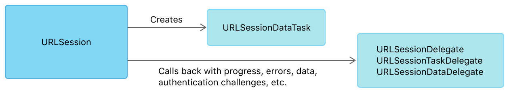

# 웹사이트 데이터를 메모리에 저장하기

> 원문 출처  
> [https://developer.apple.com/documentation/foundation/url\_loading\_system/fetching\_website\_data\_into\_memory](https://developer.apple.com/documentation/foundation/url_loading_system/fetching_website_data_into_memory)

## 개요

원격 서버와 작은 규모의 통신을 할 경우 [URLSessionDataTask](../../../etc/not-found.md) 클래스를 사용해서 response 데이터를 메모리에 저장할 수 있습니다.\(그와 반대로 [URLSessionDownloadTask](../../../etc/not-found.md) 클래스는 데이터를 바로 파일 시스템에 저장합니다.\)  data task는 웹서비스 엔드포인를 호출하는 일에 적합합니다.

[URLSession](urlsession/) 인스턴스는 task를 생성하는데 사용됩니다. 여러분의 요구사항이 단순하다면 URLSession 클래스의 [shared](../../../etc/not-found.md) 인스턴스를 사용하는 것이 좋습니다. delegate 콜백으로 전송과정 중에 상호작용을 하길 원한다면 세션을 생성할 때 [URLSessionConfiguration](urlsession/urlsessionconfiguration.md) 인스턴스를 사용하고 [URLSessionDelegate](../../../etc/not-found.md) 또는 해당 하위 프로토콜 중 하나를 구현하는 클래스를 전달할 수 있습니다. 세션은 여러개의 task를 만드는데 재사용될 수 있으므로 필요로 하는 configuration마다 세션을 만들어서 프로퍼티로 저장하십시오.


알림

세션을 필요 이상으로 만들지 마세요. 예를 들어 여러분의 앱에 비슷하게 설정된 세션이 여러개 필요하다면 하나의 세션을 만들어서 공유하세요.


세션을 생성했다면 dataTask\(\) 메서드중 하나를 사용해서 data task를 생성할 수 있습니다. task들은 일시정지 된 상태로 생성되며, [resume\(\)](../../../etc/not-found.md) 메서드를 호출해서 시작할 수 있습니다.

### Completion Handler를 사용해서 결과값 받기

데이터를 받는 가장 쉬운 방법은 completion handler를 사용하는 data task를 생성하는 것입니다. 이 배치를 사용하면 task는 개발자가 제공한 completion handler 블록에 서버의 응답, 데이터 및 오류를 전달합니다. 그림 1은 세션과 task간의 관계, 그리고 결과가 어떻게 completion handler에 전달되는지를 보여줍니다.


completion handler를 사용하는 data task를 생성하기 위해서는 URLSession의 [dataTask\(with:\)](../../../etc/not-found.md) 메서드를 호출해야 합니다. completion handler는 다음 세가지 일을 해야 합니다.

1. error 파라미터가 nil인지를 확인합니다. 그렇지 않다면 전송오류가 발생한 것입니다. 에러를 처리하고 종료시키십시오.
2. status 코드가 전송 성공을 나타내고 있는지, MIME 타입값은 예상대로인지 response 파라미터를 확인합니다. 그렇지 않다면 서버 에러를 처리하고 종료하십시오.
3. data 인스턴스를 필요에 따라 사용합니다.

목록 1은 URL의 컨텐츠를 불러오는 startLoad\(\) 메서드를 보여줍니다. 이 메서드는 URLSession 클래스의 shared 인스턴스를 사용해서 data task를 생성하고 있으며 data task는 결과값을 completion handler로 전달합니다. 로컬과 서버 에러를 확인한 다음, 이 handler는 데이터를 문자열로 변환하여 WKWebView outlet을 채우는데 사용합니다. 물론 데이터 모델을 파싱해낸다든지 가져온 데이터를 다른 용도로 사용할 수도 있습니다.

**목록 1. 데이터 로딩 결과물을 받는 completion handler 생성**

```swift
func startLoad() {
    let url = URL(string: "https://www.example.com/")!
    let task = URLSession.shared.dataTask(with: url) { data, response, error in
        if let error = error {
            self.handleClientError(error)
            return
        }
        guard let httpResponse = response as? HTTPURLResponse,
            (200...299).contains(httpResponse.statusCode) else {
            self.handleServerError(response)
            return
        }
        if let mimeType = httpResponse.mimeType, mimeType == "text/html",
            let data = data,
            let string = String(data: data, encoding: .utf8) {
            DispatchQueue.main.async {
                self.webView.loadHTMLString(string, baseURL: url)
            }
        }
    }
    task.resume()
}
```


중요

completion handler는 task를 생성한 것과는 다른 Grand Central Dispatch Queue에서 호출됩니다. 그러므로 데이터나 에러를 \(webView를 업데이트 하는 등의\) UI를 업데이트하는데 사용하는 작업은 위의 예시처럼 main queue에서 이루어져야 합니다.


### Delegate를 통해서 전송정보 및 결과를 받아보기

진행 중인 task에 대해서 더 높은 수준의 접근을 원한다면 data task를 생성할때 session에 completion handler를 제공하는 대신에 delegate를 설정할 수 있습니다. 그림 2는 이러한 구조를 보여줍니다.



이런 접근방식을 취하면 전송이 완료되거나 오류가 발생하여 실패하기 전까지 도착하는 데이터들이 부분적으로 계속해서 [URLSessionDataDelegate](../../../etc/not-found.md)의 [urlSession\(\_:dataTask:didReceive:\)](../../../etc/not-found.md) 메서드에 전달됩니다. delegate는 전송이 진행됨에 따라서 다른 종류의 이벤트도 받습니다.

delegate 접근법을 따르려면 URLSession 클래스의 단순한 shared 인스턴스보다는 URLSession 인스턴스를 직접 만들 필요가 있습니다. 목록 2에서 볼수 있듯이, 새로운 세션을 생성함으로써 session의 delegate를 본인이 직접 만든 클래스로 지정할 수 있습니다.

하나 이상의 delegate 프로토콜을 준수하는 클래스 구현을 선언하십시오\([URLSessionDelegate](../../../etc/not-found.md), [URLSessionTaskDelegate](../../../etc/not-found.md), [URLSessionDataDelegate](../../../etc/not-found.md), [URLSessionDownloadDelegate](../../../etc/not-found.md)\). 그리고 [init\(configuration:delegate:delegateQueue:\)](../../../etc/not-found.md) 초기화 메서드를 통해서 새로운 URL Session 인스턴스를 생성하십시오. 이 초기화 메서드를 통해서 configuration 인스턴스를 커스터마이징 할 수 있습니다. 예를 들어 [waitsForConnectivity](../../../etc/not-found.md)를 true로 설정하는것은 사용가능한 네트워크 연결이 없을때 바로 실패로 처리하는 대신에 적합한 네트워크 연결이 생길때까지 기다리기 때문에 아주 좋은 생각입니다.

  **목록 2. delegate를 사용하는 URLSession 생성**

```swift
private lazy var session: URLSession = {
    let configuration = URLSessionConfiguration.default
    configuration.waitsForConnectivity = true
    return URLSession(configuration: configuration,
                      delegate: self, delegateQueue: nil)
}()
```

목록 3의 startLoad\(\) 메서드는 이 세션을 사용해서 data task를 시작하고 delegate 콜백을 사용해서 전달받은 데이터와 에러를 처리합니다. 이 예제는 세개의 delegate 콜백을 구현했습니다.

* [urlSession\(\_:dataTask:didReceive:completionHandler:\)](../../../etc/not-found.md) 메서드는 성공을 나타내는 HTTP 상태코드와 text/html 또는 text/plain MIME 타입을 검사합니다. 둘 중 하나라도 해당되지 않으면 task는 취소되고 아니라면 계속해서 진행할 수 있습니다.
* [urlSession\(\_:dataTask:didReceive:\)](../../../etc/not-found.md) 메서드는 task로부터 수신되는 각 Data 인스턴스를 받아서 receivedData라는 버퍼에 추가합니다.
* [urlSession\(\_:task:didCompleteWithError:\)](../../../etc/not-found.md)는 먼저 전송 단계 에러가 발생했는지를 확인하고 에러가 없으면 receivedData 버퍼를 문자열로 변환하여 webView의 컨텐츠로 만듭니다.

**목록 3. delegate를 사용하는 URL session data task**

```swift
var receivedData: Data?

func startLoad() {
    loadButton.isEnabled = false
    let url = URL(string: "https://www.example.com/")!
    receivedData = Data()
    let task = session.dataTask(with: url)
    task.resume()
}

// delegate methods

func urlSession(_ session: URLSession, dataTask: URLSessionDataTask, didReceive response: URLResponse,
                completionHandler: @escaping (URLSession.ResponseDisposition) -> Void) {
    guard let response = response as? HTTPURLResponse,
        (200...299).contains(response.statusCode),
        let mimeType = response.mimeType,
        mimeType == "text/html" else {
        completionHandler(.cancel)
        return
    }
    completionHandler(.allow)
}

func urlSession(_ session: URLSession, dataTask: URLSessionDataTask, didReceive data: Data) {
    self.receivedData?.append(data)
}

func urlSession(_ session: URLSession, task: URLSessionTask, didCompleteWithError error: Error?) {
    DispatchQueue.main.async {
        self.loadButton.isEnabled = true
        if let error = error {
            handleClientError(error)
        } else if let receivedData = self.receivedData,
            let string = String(data: receivedData, encoding: .utf8) {
            self.webView.loadHTMLString(string, baseURL: task.currentRequest?.url)
        }
    }
}
```

다양한 delegate 프로토콜들이 예시코드에 나타난 것 이상의 메서드를 제공하며 이를 통해 인증, 리다이렉트 및 다른 특수한 경우들을 처리합니다. URLSession 문서에서는 전송중에 발생할 수 있는 다양한 콜백을 설명합니다.

## 같이 보기

### 첫 단계

* class [URLSession](urlsession/)

  연관된 네트워크 데이터 전송 태스크들의 그룹을 조정하는 객체

* class [URLSessionTask](urlsessiontask.md)

  리소스 다운로드와 같이 URLSession에서 수행되는 task

