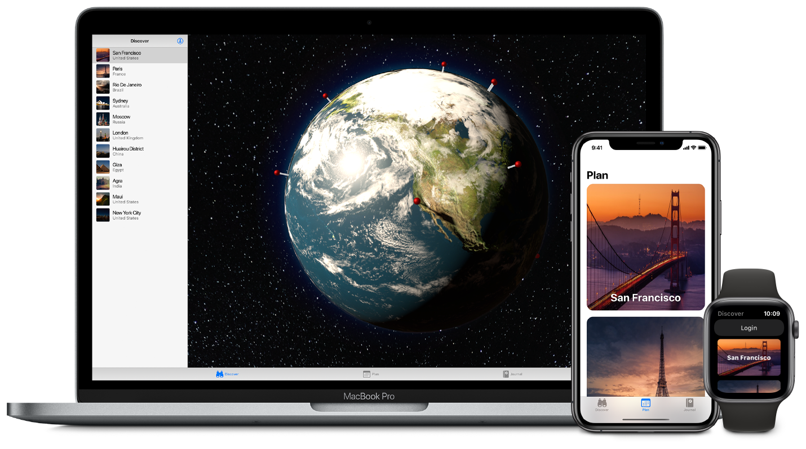

# SwiftUI

> 원문 출처  
> [https://developer.apple.com/documentation/swiftui](https://developer.apple.com/documentation/swiftui)

## Summary

> **SDKs**
>
> * iOS 13.0+
> * macOS 10.5+
> * Mac Catalyst 13.0+
> * tvOS 13.0+
> * watchOS 6.0+

## Overview

SwiftUI는 앱 UI를 선언하기 위한 뷰, 컨트롤, 레이아웃 구조를 제공합니다. 이 프레임워크는 탭, 제스처, 기타 다른 종류의 입력을 전달하기 위한 이벤트 핸들러를 앱에 제공하며 앱 모델로부터 \(사용자가 보고 상호작용하는\) 뷰와 컨트롤에 내려오는 데이터 흐름의 관리도구입니다.

[View](../../etc/not-found.md) 프로토콜을 따르는 커스텀 뷰를 만들고 SwiftUI 뷰로 구성해보세요. SwiftUI 뷰를 통해서 텍스트, 이미지를 표시하거나 스택, 리스트로 모양을 커스텀할 수 있습니다. 내장 뷰와 커스텀 뷰에 강력한 편집기를 사용하여 렌더링과 상호작용성을 커스텀할 수 있습니다.  
내장 된 뷰와 사용자 고유의 뷰에 강력한 수정자를 적용하여 렌더링 및 대화형 작업을 사용자 지정할 수 있습니다.

SwiftUI의 뷰에 UIKit, AppKit과 WatchKit 프레임워크 객체들을 통합시켜서 플랫폼에 특화된 기능을 활용할 수 있습니다. 또한 접근성 지원을 커스텀하여 앱 인터페이스를 언어별, 국가별, 문화지역별로 로컬라이징할 수도 있습니다.

## 주제

### Essensials

* [SwiftUI로 앱 만드는 방법 배우기](https://developer.apple.com/tutorials/swiftui/tutorials) 튜토리얼을 따라하면서 SwiftUI와 Xcode로 앱 만드는 방법을 배우세요.

### 사용자 인터페이스

* [뷰와 컨트롤](undefined.md) 컨텐츠를 화면에 표시하고 사용자 상호 작용을 처리하세요.
* 뷰 레이아웃과 표현 뷰를 스택에 결합하고 뷰 그룹과 리스트를 동적으로 생성하며 뷰 표현과 계층을 정의하세요
* 그리기와 애니메이션 색상, 모양, 그림자와 상태에 따른 커스텀 전환 애니메이션으로 뷰를 강화하세요
* 프레임워크 통합 기존의 앱에 SwiftUI 뷰를 통합시키고 AppKit, UIKit, WatchKit 뷰와 컨트롤러를 SwiftUI 뷰 계층에 내장시키세요

### 데이터와 이벤트

* 상태와 데이터 흐름 앱 모델 내 데이터 흐름과 변경을 제어하고 대응합니다.
* 제스처 탭, 클릭, 스와이프부터 세부 제스처까지 상호작용을 정의하세요.

### Xcode 프리뷰

* 프리뷰 커스텀 뷰의 동적 대화식 프리뷰를 생성하세요.

