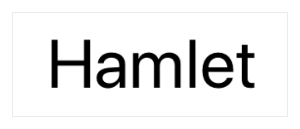

# Text

> 원문 출처  
> [https://developer.apple.com/documentation/swiftui/text](https://developer.apple.com/documentation/swiftui/text)

## Summary

> **SDKs**
>
> * iOS 13.0+
> * macOS 10.15+
> * Mac Catalyst 13.0+
> * tvOS 13.0+
> * watchOS 6.0+
> * Xcode 11.0+
>
> **Framework**
>
> * SwiftUI

## Declaration



```swift
@frozen struct Text
```



## 개요 <a id="overview"></a>

텍스트 뷰가 앱 UI에 문자열을 그릴 때에는 현재 플랫폼에 적합한 [body](../../../etc/not-found.md) 폰트를 사용합니다. 여러분은 [font\(\_:\)](../../../etc/not-found.md) 뷰 수정자로 [title](../../../etc/not-found.md)이나 [caption](../../../etc/not-found.md) 같은 다른 표준 폰트를 선택할 수 있습니다.

```swift
Text("Hamlet")
    .font(.title)
```



단순 텍스트 스타일링 이상의 세부적인 제어가 필요할 때는 시스템 폰트를 구성할 때 사용되는 것과 같은 수정자를 사용하거나 커스텀 폰트를 고를수도 있습니다. [bold\(\)](../../../etc/not-found.md) 또는 [italic\(\)](../../../etc/not-found.md) 같은 뷰 수정자를 적용해서 서식을 추가로 조정할 수 있습니다.

```swift
Text("by William Shakespeare")
    .font(.system(size: 12, weight: .light, design: .serif))
    .italic()
```


텍스트 뷰는 언제나 렌더링된 컨텐츠를 표시하는데 필요한 만큼만 공간을 사용하지만 뷰 레이아웃을 수정하는 것 또한 가능합니다. 예를 들어 [frame\(width:height:alignment:\)](../../../etc/not-found.md) 수정자를 사용하여 뷰에 크기를 제안할 수 있습니다. 뷰가 제안을 받아들였는데 텍스트가 그 크기에 맞지 않는다면 뷰는 wrapping, tightening, scaling, truncation 등의 방법을 조합하여 공간에 맞아들어가도록 조정합니다. 높이 제약 없이 너비가 100 포인트로 주어진다면 텍스트 뷰는 긴 문자열을 감쌀 수 있습니다.

```swift
Text("To be, or not to be, that is the question:")
    .frame(width: 100)
```


[lineLimit\(\_:\)](../../../etc/not-found.md), [allowsTightening\(\_:\)](../../../etc/not-found.md), [minimumScaleFactor\(\_:\)](../../../etc/not-found.md), [truncationMode\(\_:\)](../../../etc/not-found.md) 와 같은 수정자를 사용해서 뷰가 공간 제약 조건을 처리할 방법을 설정하세요. 예를 들어, 고정 너비 조건과 1열로 제한 조건을 결합한 상태에서 공간에 들어맞지 않는 텍스트를 넣으면 텍스트가 잘리게 됩니다.

```swift
Text("Brevity is the soul of wit.")
    .frame(width: 100)
    .lineLimit(1)
```


### 문자열 로컬라이징 <a id="localizing-strings"></a>

문자열 리터럴로 텍스트 뷰를 초기화하면 뷰는 [init\(\_:tableName:bundle:comment:\)](../../../etc/not-found.md) 이니셜라이저를 사용합니다. 해당 이니셜라이저는 문자열을 현지화 키로 해석하고 지정된 테이블에서 키를 찾습니다. 테이블을 지정하지 않은 경우 기본 테이블을 사용합니다.

```swift
Text("pencil") // main 번들의 기본 테이블에서 검색
```

영어와 스페인어를 지원하는 앱에서 위의 뷰는 영어 사용자와 스페인어 사용자에게 각각 "pencil"과 “lápiz”를 보여줍니다. 뷰가 현지화를 수행하지 못하는 경우에는 대신해서 키를 보여줍니다. 예를 들어 덴마크어 현지화를 지원하지 않는 동일한 앱에서 뷰는 덴마크어 사용자들에게 "pencil"을 보여줄 것입니다. 마찬가지로 앱은 현지화 정보가 없는 모든 로케일에서 "pencil"을 표시하게 됩니다.

명시적으로 문자열 리터럴의 현지화를 회피하려면 [init\(verbatim:\)](../../../etc/not-found.md) 이니셜라이저를 사용하세요.

```swift
Text(verbatim: "pencil") // 모든 로케일에서 "pencil"을 표시합니다.
```

 변수값으로 텍스트 뷰를 초기화하면 뷰는 현지화를 지원하지 않는 init\(\_:\) 이니셜라이저를 사용합니다. 하지만 init\(\_:tableName:bundle:comment:\)를 대신 트리거하는  LocalizedStringKey 인스턴스를 먼저 생성하면 현지화를 요청할 수 있습니다.

```swift
// 문자열 변수는 현지화되지 않습니다
Text(writingImplement)

// 하지만 명시적으로 현지화 문자열 키 변환을 할수 있습니다.
Text(LocalizedStringKey(writingImplement))
```

\(위의 예시와 같이\) 문자열 변수를 현지화할 때에는 문자열 리터럴을 현지화할 때처럼 초기화 파라미터를 생략함으로써 기본 테이블을 사용할 수 있습니다.

## 주제 <a id="topics"></a>

### 텍스트 뷰 생성 <a id="creating-a-text-view"></a>

* init\(LocalizedStringKey, tableName: String?, bundle: Bundle?, comment: StaticString?\) 키로 식별하여 지역화된 컨텐츠를 표시하는 텍스트 뷰를 생성합니다.
* init&lt;S&gt;\(S\) 현지화 없이 저장된 문자열을 표시하는 텍스트 뷰를 생성합니다.
* init\(verbatim: String\) 현지화 없이 문자열 리터럴을 표시하는 텍스트 뷰를 생성합니다.

### 폰트 선택 <a id="choosing-a-font"></a>

* _func_ font\(Font?\) -&gt; Text 해당 뷰의 기본 텍스트 폰트를 설정합니다.
* _func_ fontWeight\(Font.Weight?\) -&gt; Text 해당 뷰의 폰트 굵기를 설정합니다.
* _struct_ Font 환경에 의존적인 폰트

### 뷰 텍스트 스타일링 <a id="styling-the-views-text"></a>

* _func_ foregroundColor\(Color?\) -&gt; Text 뷰에 표시될 텍스트 컬러를 지정합니다.
* _func_ bold\(\) -&gt; Text 텍스트에 볼드체를 적용합니다.
* _func_ italic\(\) -&gt; Text 텍스트에 이탤릭체를 적용합니다.
* _func_ strikethrough\(Bool, color: Color?\) -&gt; Text 텍스트에 취소선을 긋습니다.
* _func_ underline\(Bool, color: Color?\) -&gt; Text 텍스트에 밑줄을 긋습니다.
* _func_ kerning\(CGFloat\) -&gt; Text 글자 간 간격이나 글꼴 삐침을 설정합니다.
* _func_ tracking\(CGFloat\) -&gt; Text 텍스트 자간을 설정합니다.
* _func_ baselineOffset\(CGFloat\) -&gt; Text 텍스트 기준선에 상대적인 수직 오프셋을 설정합니다.

### 가용 공간에 텍스트 맞추기 <a id="fitting-text-into-available-space"></a>

* _func_ allowsTightening\(Bool\) -&gt; View 한 줄에 텍스트를 맞추기 위해 필요에 따라 자간을 압축할 수 있도록 설정합니다.
* _func_ minimumScaleFactor\(CGFloat\) -&gt; View 가용 공간에 텍스트를 맞추기 위해서 축소할 수 있는 최소 배율을 지정합니다.
* _func_ truncationMode\(TruncationMode\) -&gt; View 가용 공간에 비해 너무 긴 텍스트를 잘라낼 방법을 설정합니다.
* _enum_ Text.TruncationMode 가용 공간에 비해 너무 긴 텍스트에 적용시킬 말줄임 방식

### 여러 줄 텍스트 처리 <a id="handling-multiline-text"></a>

* _func_ lineLimit\(Int?\) -&gt; View 텍스트가 뷰에서 차지할 수 있는 최대 라인 수를 지정합니다.
* _func_ lineSpacing\(CGFloat\) -&gt; View 뷰의 행간 간격을 지정합니다.
* _func_ multilineTextAlignment\(TextAlignment\) -&gt; View
* _enum_ TextAlignment 텍스트의 가로축 정렬 위치

### 레이아웃 방향 제어 <a id="controlling-the-layout-direction"></a>

* _func_ flipsForRightToLeftLayoutDirection\(Bool\) -&gt; View 레이아웃 방향이 우횡서일때 뷰 컨텐츠를 수평방향으로 뒤집을지를 결정합니다.

### 텍스트 뷰 조합 <a id="combining-text-views"></a>

* _static_ _func_ + \(Text, Text\) -&gt; Text 두개의  텍스트 뷰를 연결해서 하나의 새 텍스트 뷰로 만듭니다.

### 텍스트 뷰 비교 <a id="comparing-text-views"></a>

* _static_ _func_ == \(Text, Text\) -&gt; Bool 두 텍스트의 동일성을 나타냅니다.
* _static_ _func_ != \(Text, Text\) -&gt; Bool 두 텍스트가 같지 않음을 가리킵니다.

### 표준 수정자 적용 <a id="applying-standard-modifiers"></a>

* 뷰 수정자 하나의 뷰와 그 안에 포함된 뷰에 표준 수정자를 적용하여 구성하세요

## 관련 문서 <a id="relationships"></a>

### Conforms To

* Equatable
* [View](view.md)

## 같이 보기 <a id="see-also"></a>

### Text

* _struct_ [TextField](textfield.md) 편집 가능한 텍스트 인터페이스를 보여주는 컨트롤
* _struct_ SecureField 사용자가 노출되지 않는 텍스트를 입력할 수 있는 컨트롤
* _struct_ Font 실행환경에 의존적인 폰트


