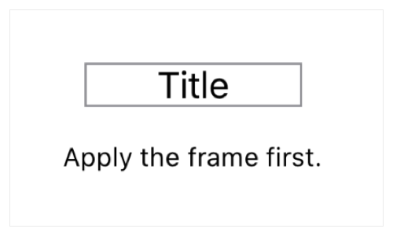
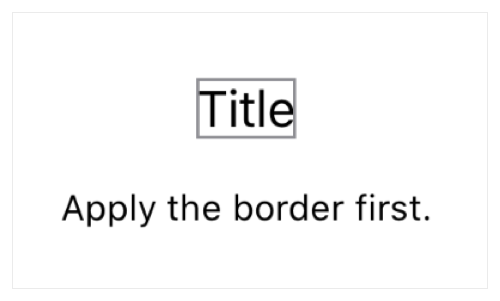

# View

> 원문 출처  
> [https://developer.apple.com/documentation/swiftui/view](https://developer.apple.com/documentation/swiftui/view)

## Summary

> **SDKs**
>
> * iOS 13.0+
> * macOS 10.5+
> * Mac Catalyst 13.0+
> * tvOS 13.0+
> * watchOS 6.0+
> * Xcode 11.0+
>
> **Framework**
>
> * SwiftUI

## Declaration



```swift
protocol View
```



## 개요 <a id="overview"></a>

View 프로토콜을 따르는 타입을 선언함으로써 커스텀 뷰를 생성할 수 있습니다. [body](../../../etc/not-found.md)라는 계산된 속성\(Computed property\)을 구현하여 커스텀 뷰에 컨텐츠를 제공하세요.

```swift
struct MyView: View {
    var body: some View {
        Text("Hello, World!")
    }
}
```

위 예제의 [Text](../../../etc/not-found.md) 인스턴스처럼 SwiftUI에서 제공하는 하나 이상의 기본 뷰를 뷰 계층으로 결합하여 뷰의 body를 조합하세요.

View 프로토콜은 default 구현과 함께 프로토콜 메서드로 정의된 modifier set을 제공합니다. 이 modifier set은 앱 레이아웃 내에서 뷰를 설정하고 위치를 조정하는데 사용됩니다.  
Modifier는 일반적으로 다른 뷰 내에서 특정하여 호출될 수 있도록 뷰 인스턴스를 감싸는 방식으로 동작합니다. 예를들어, text 뷰에 [opacity\(\_:\)](../../../etc/not-found.md) modifier를 추가함으로써 투명도가 적용된 새로운 뷰를 반환받을 수 있습니다.

```swift
Text("Hello, World!")
    .opacity(0.5)  // Display partially transparent text.
```

Modifier의 효과는 자식뷰로 전파되어, 자식 뷰에서 명시적으로 오버라이드하지 않는 한 같은 효과가 적용됩니다. 예를 들어, 다른 뷰를 세로로 쌓는 역할만 하는 [VStack](../../../etc/not-found.md)은 자체적으로 표시할 텍스트가 없습니다. 그러므로 [font\(\_:\)](../../../etc/not-found.md) modifier를 스택에 적용하여도 스택 그 자체에는 아무런 효과가 없습니다. 그러나 스택의 자식 뷰에는 적용이 되며, 특정 자식 뷰에서 스택의 modifier를 오버라이드하는 것도 가능합니다:

```swift
VStack {
    Text("Title")
        .font(.headline)  // 이 뷰에 한해 폰트를 오버라이딩 합니다.
    Text("First body line")
    Text("Second body line")
}
.font(.body)  // 이 스택의 기본 폰트를 설정합니다.
```

이전의 결과를 래핑하는 체인 modifier는 흔히 사용됩니다. 예를 들어, 텍스트 뷰에 너비가 지정된 [frame\(width:height:alignment:\)](../../../etc/not-found.md) modifier를 사용해서 레이아웃을 잡은 다음, [border\(\_:width\)](../../../etc/not-found.md) modifier로 윤곽을 그릴 수 있습니다:

```swift
Text("Title")
    .frame(width: 100)
    .border(Color.gray)
```

Modifier를 적용하는 순서가 중요합니다. 예를 들어, 위 예제 코드의 border는 frame의 전체 길이에 맞추어 윤곽을 그립니다.



만약 border가 먼저 적용된다면 윤곽은 text view를 따라 그려지게 되며 텍스트를 렌더링하는데 필요한 공간 이상으로 커지지 못할 것입니다.

```swift
Text("Title")
    .border(Color.gray)  // border가 먼저 적용됩니다.
    .frame(width: 100)
```

100 포인트 너비의 보이지 않는 다른 뷰에 감싸는 것은 복합 뷰의 레이아웃에는 영향을 미치겠지만 border에는 아무런 효과가 없습니다.




## 주제

### 커스텀 뷰 구현

* _var_ body: Self.Body 뷰의 동작과 컨텐츠 **필수.** 기본 구현이 제공됩니다

### 뷰  설정

* 레이아웃 계층구조 내의 뷰에 크기, 위치, 정렬, 패딩 등을 조정함으로써 뷰 자신의 위치를 잡는 방식을 알려줍니다.
* 접근성 장애인을 포함한 가능한 많은 사람들이 접근 가능한 뷰를 만들어보세요.
* 렌더링 스케일링, 마스킹 또는 그래픽 효과를 적용하는 등 시스템이 뷰를 그리는 방식에 변화를 줄 수 있습니다.
* 스타일링 뷰에 포함되는 텍스트, 컨트롤, 기타 컨텐츠에 적용할 스타일을 지정하세요.

### 상호작용성 제공

* 입력과 이벤트 사용자 입력과 시스템 이벤트에 반응하도록 뷰에 동작을 제공하세요.
* 뷰 표현 특정 조건에서 보여질 수 있는 부가적인 뷰를 정의하세요.
* 상태 뷰 설정값에 접근하고 구성 데이터로 자식 뷰를 제공하세요.

### Xcode에서 Preview 구성하기

* _func_ previewDevice\(PreviewDevice?\) -&gt; View Preview의 장치를 재정의합니다.
* _func_ previewDisplayName\(String?\) -&gt; View 에디터에서 사용자에게 보여질 이름을 제공합니다.
* _func_ previewLayout\(PreviewLayout\) -&gt; View Preview 컨테이너의 크기를 재정의합니다.

### 뷰 식별하기

* _func_ id&lt;ID&gt;\(ID\) -&gt; View 삽입, 삭제가 가능하며 유일하게 식별되는 뷰를 생성합니다.
* _func_ equatable\(\) -&gt; EquatableView&lt;Self&gt; 새 값이 기존 값과 동일할 때 뷰가 자식뷰를 업데이트 하지 않도록 합니다. Self가 Equatable을 준수할 때 사용가능합니다.
* _associatedtype_ Body 뷰의 본문을 나타내는 뷰 타입 **필수**

### 뷰 modifier 구현하기

* _func_ modifier&lt;T&gt;\(T\) -&gt; ModifiedContent&lt;Self, T&gt; Modifier를 뷰에 적용합니다.
* _struct_ ModifiedContent Modifier가 적용된 값
* _struct_ EmptyModifier 비어있거나 식별되는 modifier


## 관련 문서

### Inherited By

* DynamicViewContent
* NSViewControllerRepresentable
* NSViewRepresentable
* Shape
* UIViewControllerRepresentable
* UIViewRepresentable
* WKInterfaceObjectRepresentable

### Confirming Types

* AngularGradient
* AnyView
* Button
* ButtonStyleConfiguration.Label
* Color
* DatePicker
* Divider
* EditButton
* EmptyView
* EquatableView
* ForEach 컨텐츠가 View를 준수하면 준수합니다.
* Form
* GeometryReader
* Group 컨텐츠가 View를 준수하면 준수합니다.
* GroupBox
* HSplitView
* HStack
* Image
* LinearGradient
* List
* MenuButton
* ModifiedContent 컨텐츠가 View를 준수하고 modifier가 viewModifier를 준수하면 준수합니다.
* NavigationLink
* NavigationView
* Never
* Optional 옵셔널이 View를 준수하면 준수합니다.
* PasteButton
* Picker
* PrimitiveButtonStyleConfiguration.Label
* RadialGradient
* ScrollView
* Section 부모, 컨텐츠, Footer가 모두 View를 준수할 때 준수합니다.
* SecureField
* Slider
* Stepper
* SubscriptionView
* TabView
* Text
* TextField
* Toggle
* ToggleStyleConfiguration.Label
* TupleView
* VSplitView
* VStack
* ZStack

## 같이 보기

### Essentials

* [뷰의 생성과 조합](https://developer.apple.com/tutorials/swiftui/creating-and-combining-views) 이 튜토리얼은 여러분이 좋아하는 장소를 발견하고 공유하는 _Landmarks_라는 iOS 앱을 만들면서 진행됩니다. 여러분은 랜드마크의 상세정보를 보여주는 화면을 구성하는 것부터 시작하게 될 것입니다.
* [UI 컨트롤로 작업하기](https://developer.apple.com/tutorials/swiftui/working-with-ui-controls) Landmarks 앱에서는 사용자가 프로필을 작성함으로써 개성을 표현할 수 있습니다. 사용자들에게 자기 자신의 프로필을 수정할 수 있는 기능을 제공하기 위해서 여러분들은 편집모드를 추가하고 설정 화면을 디자인하게 될 것입니다.

