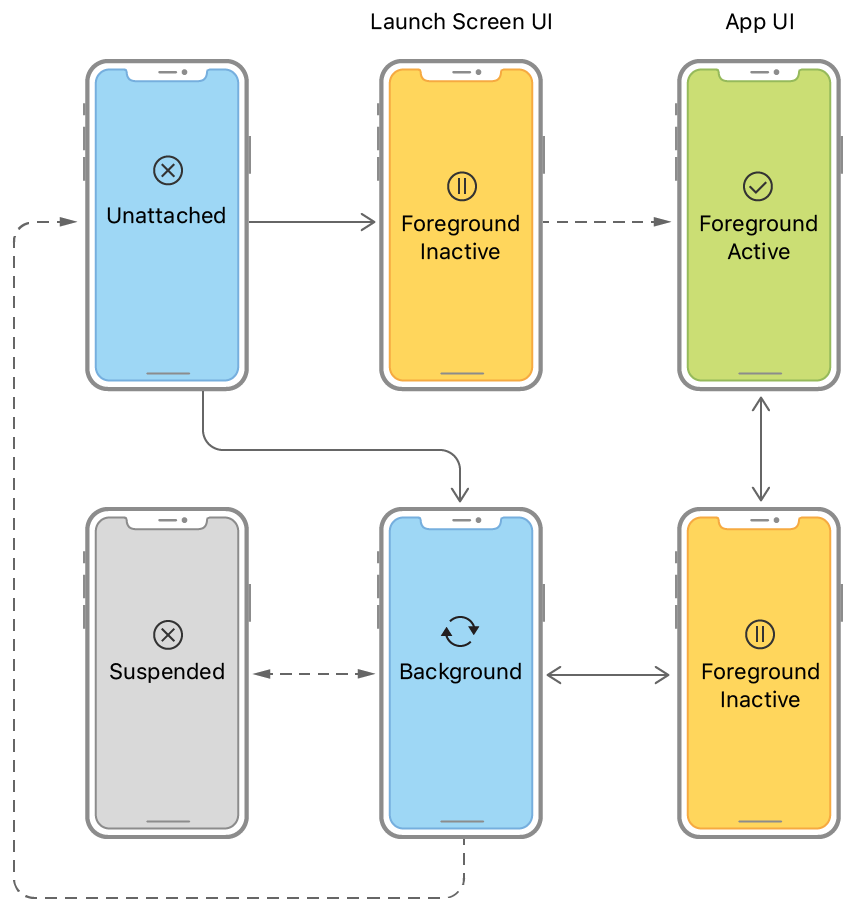
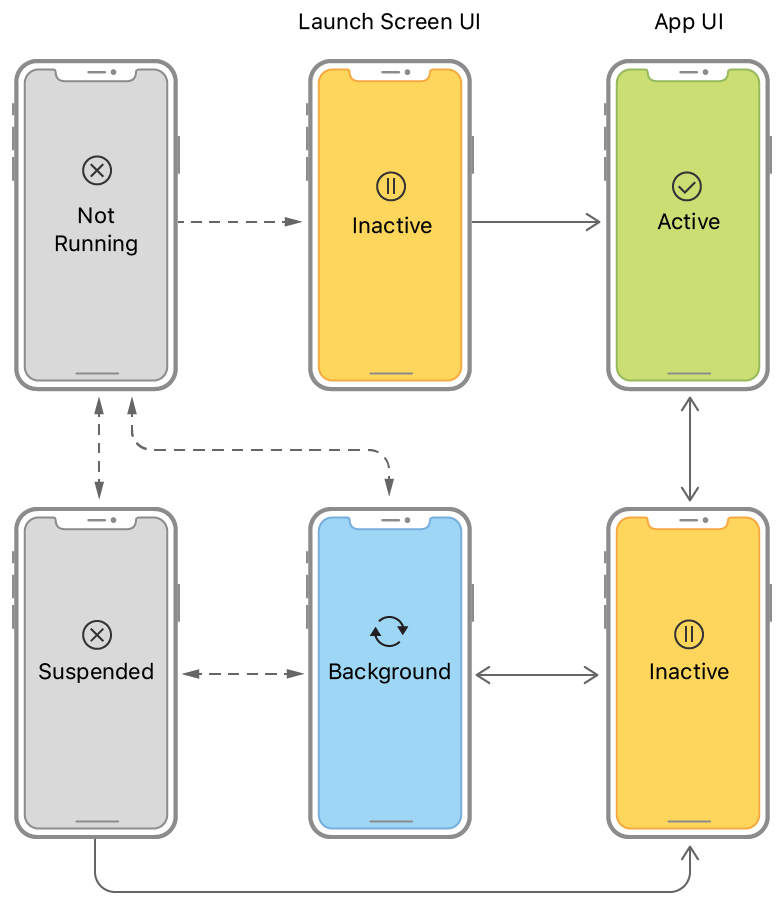

# 앱 라이프 사이클 관리하기

> 원문 출처  
> [https://developer.apple.com/documentation/uikit/core\_app/managing\_your\_app\_s\_life\_cycle](https://developer.apple.com/documentation/uikit/core_app/managing_your_app_s_life_cycle)

## 개요 

앱은 현재 상태에 따라서 할 수 있는 작업과 할 수 없는 작업이 결정됩니다. 예를 들어, forground 앱은 사용자의 관심을 끌고 있고 있기 때문에 CPU를 포함한 시스템 자원에 있어서 우선권을 갖습니다. 반면에 background 앱은 화면에 나타나지 않기 때문에 가능한 한 적게, 되도록이면 아예 동작하지 않아야 합니다. 개발자는 앱의 상태가 변화할 때마다 앱의 동작을 적절하게 조절해주어야 합니다.

UIKit은 delegate 객체의 메서드를 적절히 호출함으로써 앱의 상태가 변화했음을 알려줍니다:

* iOS 13부터 scene-based 앱에서는 [UISceneDelegate](../../../etc/not-found.md) 객체를 통해서 라이프 사이클 이벤트에 대응합니다.
* iOS 12와 그 이전 버전에서는 [UIApplicationDelegate](../../../etc/not-found.md) 객체를 통해서 라이프 사이클 이벤트에 대응합니다.


Note

앱이 scene을 지원한다면 13버전 이상의 iOS는 무조건 scene delegate를 사용할 것입니다. iOS 12 이하의 시스템은 app delegate를 사용합니다


### Scene 기반 라이프 사이클 이벤트에 대응하기 

Scene을 지원하는 앱에서 UIKit은 라이프 사이클 이벤트가 발생할 때마다 각각의 이벤트를 전달합니다. Scene은 기기에서 실행되는 앱 UI의 인스턴스 하나를 의미합니다. 사용자는 각 앱에서 여러개의 scene을 생성할 수 있으며, 각각의 scene을 독립적으로 숨기거나 보이게 할 수 있습니다. 각 scene은 고유의 라이프 사이클을 가지고 있기 때문에 서로 다른 실행 상태에 있을 수 있습니다. 예를 들어 하나의 scene은 foreground에 올라와 있을 때, 나머지 scene들은 background 또는 중지상태일 수가 있습니다.


Important

Scene은 Opt-in 기능입니다. \(기본 옵션이 아니라 설정 해주어야 사용가능하다는 뜻 - 역자 주\)  
기본 설정을 활성화하기 위해서는 Info.plist 파일에서 [UIApplicationSceneManifest](../../../etc/not-found.md) 키를 [Specifying the Scenes Your App Supports](https://developer.apple.com/documentation/uikit/app_and_environment/scenes/specifying_the_scenes_your_app_supports) 설명에 따라서 설정해야 합니다.


다음 그림은 scene들의 상태 전환을 보여줍니다. 사용자나 시스템이 앱에 새로운 scene을 요청하면 UIKit은 scene을 생성하고 unattached 상태로 둡니다. 사용자가 요청한 scene은 빠르게 foreground로 전환되어 화면에 나타납니다. 시스템이 요청한 scene은 보통 background로 이동하여 이벤트를 처리합니다. 예를 들면 시스템은 위치 이벤트를 처리할 scene을 background에서 실행하기도 합니다. 사용자가 앱의 UI를 닫으면 UIKit은 관련된 scene을 background 상태로 이동시키고, 최종적으로는 중단 상태로 만듭니다. UIKit은 리소스 반환을 요구받으면 언제든지 backgroun 또는 중단된 scene의 연결을 끊고 unattached 상태로 되돌려놓을 수 있습니다.  

Scene 전환을 사용하여 다음 작업들을 수행하세요:

* UIKit이 scene을 앱에 연결할 때 scene의 최초 UI를 구성하고 scene에 필요한 데이터를 불러오세요.
* Forground-active 상태로 전환될 때 UI를 구성하고 사용자와 상호작용할 준비를 하세요. \([Preparing Your UI to Run in the Foreground](https://developer.apple.com/documentation/uikit/app_and_environment/scenes/preparing_your_ui_to_run_in_the_foreground).\)
* Foreground-active 상태에서 벗어날 때 데이터를 저장하고 앱 동작을 중단시키세요. \([Preparing Your UI to Run in the Background](https://developer.apple.com/documentation/uikit/app_and_environment/scenes/preparing_your_ui_to_run_in_the_background)\)
* Background 상태에 진입 시 중요한 작업을 끝마치고, 되도록 많은 메모리를 해제하고, 앱 스냅샷을 준비하세요 \([Preparing Your UI to Run in the Background](https://developer.apple.com/documentation/uikit/app_and_environment/scenes/preparing_your_ui_to_run_in_the_background)\)
* Scene의 연결이 끊기면 scene과 관련된 공유 리소스를 정리하세요.
* scene과 관련된 이벤트 외에, 앱이 실행될 때에도 [UIApplicationDelegate](../../../etc/not-found.md)를 통해 응답을 해야 합니다. 앱 실행시 필요한 작업에 대한 정보는 [Responding to the Launch of Your App](https://developer.apple.com/documentation/uikit/app_and_environment/responding_to_the_launch_of_your_app)을 참조하세요.

### App 기반 라이프 사이클 이벤트에 대응하기 

iOS 12 이하에서는 scene을 지원하지 않으며, UIKit은 모든 라이프 사이클 이벤트를 UIApplicationDelegate 객체를 통해 전달합니다. App delegate는 분리된 스크린에 표시되는 것까지 포함하여 앱의 모든 window를 관리합니다. 결과적으로, 앱 상태 전환은 외부 디스플레이에 표시되는 컨텐츠를 포함하여 앱의 전체 UI에 영향을 줍니다.

다음 그림은 app delegate 객체와 관련된 상태 전환을 보여주고 있습니다. 실행 이후, 시스템은 앱이 스크린에 나타나는지 여부에 따라서 앱을 비활성 또는 background 상태로 만듭니다. foreground로 실행할 시, 시스템은 자동으로 앱을 활성화 상태로 전환시킵니다. 그 이후 종료될 때까지 앱은 active와 background 상태 사이를 오갑니다.

앱 전환을 사용하여 다음 작업을 수행하세요:

* 실행 시 앱의 데이터 구조화 UI를 초기화 하세요. \([Responding to the Launch of Your App](https://developer.apple.com/documentation/uikit/app_and_environment/responding_to_the_launch_of_your_app)\)
* 활성화 시 UI 구성을 마치고 사용자와의 상호작용을 준비하세요. \([Preparing Your UI to Run in the Foreground](https://developer.apple.com/documentation/uikit/app_and_environment/scenes/preparing_your_ui_to_run_in_the_foreground)\)
* 비활성화 시 데이터를 저장하고 앱의 동작을 중단시키세요. \([Preparing Your UI to Run in the Background](https://developer.apple.com/documentation/uikit/app_and_environment/scenes/preparing_your_ui_to_run_in_the_background)\)
* Background 상태로 전환 시 중요합 작업을 마치고, 최대한 많은 메모리를 해제하고, 앱 스냅샷을 준비하세요. \([Preparing Your UI to Run in the Background](https://developer.apple.com/documentation/uikit/app_and_environment/scenes/preparing_your_ui_to_run_in_the_background)\)
* 종료 시 모든 작업을 즉시 중단하고 공유 리소스를 해제하세요. \([applicationWillTerminate\(\_:\)](../../../etc/not-found.md)\)

### 다른 중요한 이벤트에 응답하기 

앱은 라이프 사이클 이벤트 뿐만 아니라 다음 테이블에 나열된 이벤트들도 처리할 준비가 되어야 합니다. UIApplicationDelegate 객체를 사용하여 이들 이벤트의 대다수를 처리하세요. 경우에 따라 노티피케이션을 사용하여 처리할 수도 있으며 앱의 다른 부분에서 응답하는 것이 가능합니다.

<table>
  <thead>
    <tr>
      <th style="text-align:left"></th>
      <th style="text-align:left"></th>
    </tr>
  </thead>
  <tbody>
    <tr>
      <td style="text-align:left">Memory Warning</td>
      <td style="text-align:left">&#xC571;&#xC758; &#xBA54;&#xBAA8;&#xB9AC; &#xC0AC;&#xC6A9;&#xB960;&#xC774;
        &#xB108;&#xBB34; &#xB192;&#xC744; &#xACBD;&#xC6B0; &#xBC1B;&#xB294; &#xBA54;&#xC138;&#xC9C0;&#xC785;&#xB2C8;&#xB2E4;.
        <a
        href="../../../etc/not-found.md">&#xBA54;&#xBAA8;&#xB9AC; &#xACBD;&#xACE0;&#xC5D0; &#xC751;&#xB2F5;&#xD558;&#xAE30;</a>&#xBB38;&#xC11C;&#xB97C;
          &#xCC38;&#xC870;&#xD558;&#xC138;&#xC694;.</td>
    </tr>
    <tr>
      <td style="text-align:left">Protected data becomes available/unavailable</td>
      <td style="text-align:left">
        
&#xC720;&#xC800;&#xAC00; &#xAE30;&#xAE30;&#xB97C; &#xC7A0;&#xADF8;&#xAC70;&#xB098;,
          &#xC7A0;&#xAE08; &#xD574;&#xC81C;&#xD560; &#xB54C; &#xBC1B;&#xB294; &#xBA54;&#xC138;&#xC9C0;&#xC785;&#xB2C8;&#xB2E4;.

        
<a href="../../../etc/not-found.md">applicationProtectedDataDidBecomeAvailable(_:)</a> &#xC640;
          <a
          href="../../../etc/not-found.md">applicationProtectedDataWillBecomeUnavailable(_:)</a>
             &#xB97C; &#xCC38;&#xC870;&#xD558;&#xC138;&#xC694;.

      </td>
    </tr>
    <tr>
      <td style="text-align:left">Handoff tasks</td>
      <td style="text-align:left">
        
NSUserActivity &#xAC1D;&#xCCB4;&#xC758; &#xCC98;&#xB9AC;&#xAC00; &#xD544;&#xC694;&#xD560;
          &#xB54C; &#xBC1B;&#xB294; &#xBA54;&#xC138;&#xC9C0;&#xC785;&#xB2C8;&#xB2E4;.

        
<a href="../../../etc/not-found.md">application(_:didupdate:)</a>&#xB97C;
          &#xCC38;&#xC870;&#xD558;&#xC138;&#xC694;.

      </td>
    </tr>
    <tr>
      <td style="text-align:left">Time changes</td>
      <td style="text-align:left">
        
&#xC774;&#xB3D9;&#xD1B5;&#xC2E0;&#xC0AC;&#xB85C;&#xBD80;&#xD130; &#xC218;&#xC2E0;&#xB418;&#xB294;
          &#xC2DC;&#xAC04; &#xC5C5;&#xB370;&#xC774;&#xD2B8; &#xB4F1;&#xC758; &#xC774;&#xC720;&#xB85C;
          &#xC2DC;&#xAC04;&#xC758; &#xBCC0;&#xD654;&#xAC00; &#xBC1C;&#xC0DD;&#xD560;
          &#xB54C; &#xBC1B;&#xB294; &#xBA54;&#xC138;&#xC9C0;&#xC785;&#xB2C8;&#xB2E4;.

        
<a href="../../../etc/not-found.md">applicationSignificantTimeChange(_:)</a>&#xB97C;
          &#xCC38;&#xC870;&#xD558;&#xC138;&#xC694;.

      </td>
    </tr>
    <tr>
      <td style="text-align:left">Open URLs</td>
      <td style="text-align:left">
        
&#xC571;&#xC774; &#xB9AC;&#xC18C;&#xC2A4;&#xB97C; &#xC5F4;&#xC5B4;&#xC57C;
          &#xD560; &#xB54C; &#xC218;&#xC2E0;&#xB418;&#xB294; &#xBA54;&#xC138;&#xC9C0;&#xC785;&#xB2C8;&#xB2E4;.

        
<a href="../../../etc/not-found.md">application(_:open:options:)</a>&#xB97C;
          &#xCC38;&#xC870;&#xD558;&#xC138;&#xC694;.

      </td>
    </tr>
  </tbody>
</table>

## 주제 

### 동작 이벤트 

* [메모리 경고에 응답하기](../../../etc/not-found.md) 시스템에서 요청하면 메모리를 확보합니다.

## 같이 보기 

### 라이프 사이클 

* 앱 실행에 대응하기 앱 데이터 구조를 초기화하고 실행시킬 준비를 하세요. 그리고 실행 중에 발생하는 시스템 요청에 대응하세요.
* _class_ [UIApplication](uiapplication.md) iOS에서 실행되는 앱의 제어와 조정의 중심점
* _protocol_ UIApplicationDelegate 앱 라이프 타임동안 발생하는 중요한 이벤트에 대해 응답하기 위해서 UIApplication 싱글턴 객체가 호출하는 메서드 집합
* Scenes 여러 개의 앱 UI 인스턴스를 동시에 관리하고 리소스를 적절한 인스턴스에 분배하세요.

