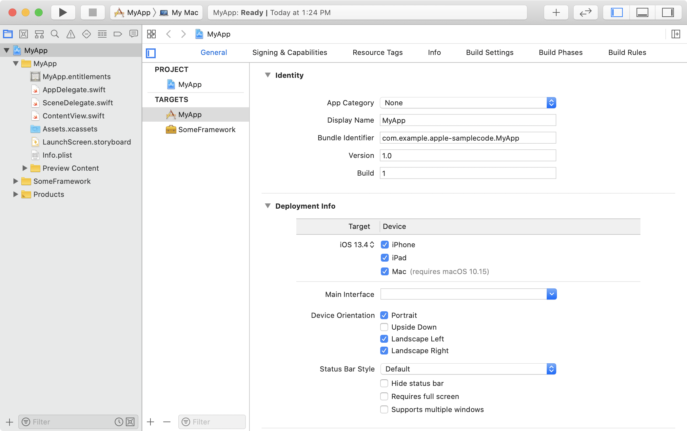
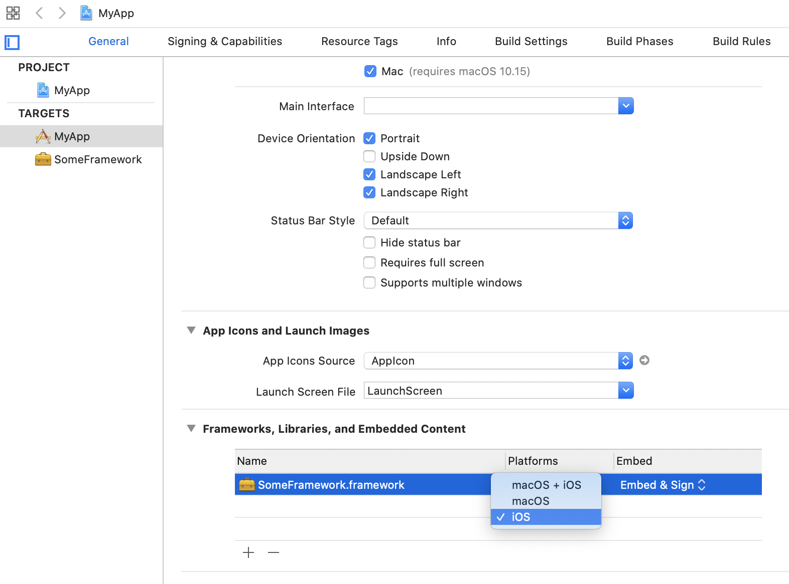

# iPad 앱을 Mac 버전으로 만들기

> 원문 출처  
> [https://developer.apple.com/documentation/uikit/mac\_catalyst/creating\_a\_mac\_version\_of\_your\_ipad\_app](https://developer.apple.com/documentation/uikit/mac_catalyst/creating_a_mac_version_of_your_ipad_app)

## Summary

> **Framework**
>
> * UIKit

## 개요 <a id="overview"></a>

Xcode 11부터 Mac Catalyst를 사용하여 아이패드 앱을 맥 버전으로 만들 수 있게 되었습니다.  
앱이 사용하는 기능과 프레임워크에 따라서 몇몇 단계가 더 필요하긴 하지만, 체크박스를 클릭하는 것만으로 앱을 맥 버전으로 설정할 수 있습니다.


알림

아이패드 앱의 맥버전 디자인에 관한 정보는 휴먼 인터페이스 가이드 중의 [Mac Catalyst](https://developer.apple.com/design/human-interface-guidelines/ios/overview/mac-catalyst/)를 살펴보세요.


## 맥용 앱 설정 <a id="configure-your-app-for-mac"></a>

맥 지원을 추가하기 위해서는 Xcode 프로젝트를 열고 설정하기를 원하는 iOS 타겟을 선택해야 합니다. General 탭의 Deployment Info 아래에서 Mac 체크박스를 선택하세요. \(앱이 아이폰만 지원한다면 이 체크박스는 사용할 수 없습니다\)



Mac 지원을 활성화하면 Xcode는 프로젝트에 [App Sandbox Entitlement](../../../etc/not-found.md)를 추가합니다. Xcode는 이 자격Entitlement을 Mac 버전의 앱에만 포함시키며, iOS 버전에는 포함시키지 않습니다.  
또한, Xcode는 지원 대상 리스트에 My Mac을 추가합니다. Xcode를 통해서 Mac 앱을 실행하고자 할 때에는 My Mac을 선택하세요.

이 시점에서 여러분은 맥 버전의 앱을 빌드하고, 실행할 수 있게 됩니다. 직접 해보려면 My Mac을 대상으로 선택하고 프로젝트를 실행하세요.

## 체크박스 이후 <a id="go-beyond-the-checkbox"></a>

다음과 같은 이유로 아직 맥 버전의 앱이 제대로 실행되지 않을 수도 있습니다:

* 호환되지 않는 프레임워크, 라이브러리 또는 임베디드 컨텐츠가 프로젝트에 포함된 경우.
* 소스코드가 지원하지 않는 API를 참조하는 경우

맥 지원을 활성화하면 Xcode는 가능한 범위 내에서 자동으로 프로젝트의 맥 빌드로부터 호환되지 않는 임베디드 컨텐츠와 프레임워크를 제거합니다. 하지만 여전히 다른 프레임워크와 컨텐츠를 직접 배제할 필요가 있습니다.

\(비호환\) 항목을 직접 제거하기 위해서는 iOS Target &gt; General 탭 &gt; Frameworks, Libraries, and Embedded Content를 열어야 합니다. 그리고 나서 해당 항목의 플랫폼 설정을 iOS로 선택합니다. 이 설정은 맥 버전의 앱에서 해당 항목을 제외시킵니다.



소스코드에서 맥 버전의 앱에서는 호환되지 않는 API를 참조하고 있다면 targetEnvironment\(\): 플랫폼 조건을 사용하여 조건부 컴파일 블록으로 해당 코드를 감싸세요.

```swift
#if !targetEnvironment(macCatalyst)
// 맥 버전에서 제외할 코드
#endif
```

같은 접근법을 통해 macOS에서만 사용가능한 프레임워크와 코드를 포함시킬 수 있습니다. 프레임워크의 경우, 플랫폼 세팅에서 macOS를 선택하고 `#if targetEnvironment(macCatalyst)` 문으로 코드를 감쌀 수 있습니다.

## 조금 더 맥 앱처럼 <a id="make-your-app-more-like-a-mac-app"></a>

지금까지의 단계를 따라 여러분은 아이패드 앱을 맥에서 실행할 수 있게 되었을 것입니다. 그러나 여러분의 새 앱을 소비자들에게 배포하기 전에 이 앱을 좀더 맥 앱처럼 만들 몇가지 변경이 필요합니다.  
더 알고 싶으시다면 [아이패드 앱의 맥 최적화](optimizing-your-ipad-app-for-mac.md) 문서를 보세요.

