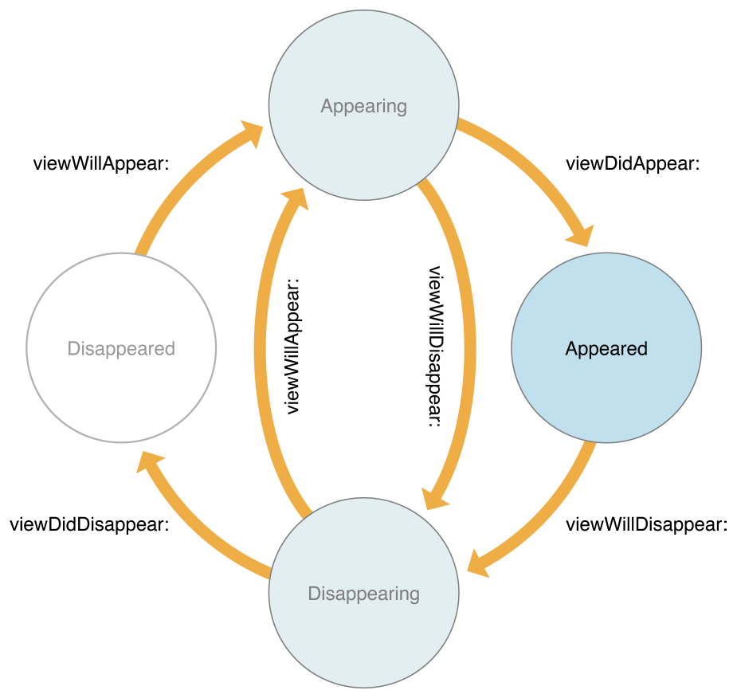

# UIViewController

> 원문 출처[https://developer.apple.com/documentation/uikit/uiviewcontroller](https://developer.apple.com/documentation/uikit/uiviewcontroller)

## 개요

UIViewController 클래스는 모든 view controller에 공통적인 동작을 정의합니다.  
UIViewController 클래스의 인스턴스를 직접 만드는 경우는 거의 없습니다. 대신 UIViewController를 하위 클래스로 만들고 view controller의 뷰 계층 구조를 관리하는 데 필요한 메서드와 프로퍼티를 추가하세요.

view controller의 주요 임무는 다음과 같습니다.

* 데이터 변화에 따라서 view 컨텐츠를 업데이트
* view와의 사용자 상호작용에 응답
* view를 리사이징하고 전체적인 인터페이스의 레이아웃 관리
* 앱 내에서 \(다른 view controller를 포함한\) 다른 객체와의 조정

view controller는 자신이 관리하는 view에 단단히 바인딩되어 있고 view 계층에서 이벤트를 처리하는 데 참여합니다. 특히 view controller는 UIResponder 객체로써 view controller의 루트 뷰와 해당 뷰의 상위 뷰 사이에 있는 responder chain에 삽입되며 일반적으로 다른 view controller에 속합니다. view controller상의 어떤 view도 이벤트를 처리하지 않는다면 view controller는 직접 이벤트를 처리하거나 상위 뷰로 전달할 수 있는 옵션을 제공합니다.

view controller가 단독적으로 사용되는 일은 거의 없습니다. 대부분의 경우 유저 인터페이스의 일부를 담당하는 여러개의 view controller가 같이 사용됩니다. 예를 들어, 하나의 view controller에 항목 테이블이 표시되는 동안 다른 view controller에 해당 테이블에서 선택한 항목이 표시됩니다.  
일반적으로 하나의 view controller에는 하나의 뷰만 표시됩니다. view controller는 새로운 뷰 세트를 표시하기 위해 다른 view controller를 표시하거나, 다른 view controller의 컨텐츠에 대한 컨테이너 역할을 하고 원하는 대로 뷰를 애니메이션할 수 있습니다.

## SubClassing Notes

대부분의 앱에는 UIViewController의 커스텀 하위 클래스가 적어도 하나 이상 포함되어 있습니다. 커스텀 view controller는 앱의 생김새와 사용자 상호작용에 응답하는 방법을 포함하여 앱의 전반적인 동작을 정의합니다. 다음 섹션에서는 사용자 정의 하위 클래스에서 수행하는 몇 가지 작업에 대한 간략한 개요를 제공합니다. view controller의 사용 및 구현에 대한 자세한 내용은 [iOS용 뷰 컨트롤러 프로그래밍 가이드](../../../etc/not-found.md)를 참조하십시오.

### 뷰 관리

각 view controller는 view 계층 구조를 관리하며 루트 뷰는 이 클래스의 view 프로퍼티에 저장됩니다. 루트 뷰는 주로 나머지 view 계층 구조의 컨테이너 역할을 합니다. 루트 뷰의 크기와 위치는 해당 view를 소유한 객체\(상위 view controller 또는 앱의 window\)에 의해 결정됩니다. window가 소유하고있는 view controller는 앱의 루트 뷰 컨트롤러이며 view의 크기는 window를 채울 수 있는 정도로 조정됩니다.

view controller는 소유한 view를 곧바로 로드하지 않습니다. view는 해당 프로퍼에 처음 액세스할때 로드 또는 생성됩니다. view controller의 view를 지정하는 방법에는 여러가지가 있습니다.

* [스토리보드](../../../etc/not-found.md)에 view controller와 view를 지정하세요. 스토리보드는 view를 지정하는 기본 방법입니다. 스토리보드를 사용해서 view와 view controller에 대한 해당 관계를 설정할 수 있습니다. 또한 view controller 사이의 관계와 하위 뷰를 지정하면 앱 동작을 보고 수정하는 것이 더 쉬워집니다.  스토리보드에서 view controller를 로드하려면 [UIStoryboard](../../../etc/not-found.md) 객체의 [instantiateViewController\(withIdentifier :\)](../../../etc/not-found.md) 메서드를 호출하십시오. UIStoryboard 객체는 view controller를 생성하여 코드에 반환합니다.
* [Nib 파일](../../../etc/not-found.md)을 사용하여 view controller에 대한 view를 지정하세요. nib 파일을 사용하면 단일 view controller의 view를 지정할 수 있지만 view controller 사이의 segue 또는 관계를 정의할 수는 없습니다. nib 파일은 view controller 자체에 대한 최소한의 정보만 저장합니다.  nib 파일을 사용하여 view controller 객체를 초기화하려면 view controller 클래스를 프로그래밍 방식으로 만들고 [init\(nibName : bundle :\)](../../../etc/not-found.md) 메서드를 사용하여 초기화하세요. view가 요청되면 view controller는 nib 파일에서 view를 로드합니다.
* [loadView\(\)](../../../etc/not-found.md) 메서드를 사용하여 view controller의 view를 지정하세요. 이 방법에서는 뷰 계층 구조를 프로그래밍 방식으로 만들고 해당 계층 구조의 루트 뷰를 view controller의 view 프로퍼티에 할당합니다.

이러한 모든 방법은 적절한 view의 집합을 만들어 view 프로퍼티를 통해 노출한다는 점에서 같은 결과를 만들어냅니다.


중요

view controller는 view와 view가 생성하는 모든 하위 뷰의 유일한 소유자입니다. 또한 view controller는 view를 생성하거나 \(view controller 자체가 릴리즈 될 때와 같이\) 소유권을 반환하는 일에 있어서 책임이 있습니다. view 객체를 스토리보드나 nib 파일에 저장하는 경우 각 view controller 객체는 view 객체를 요청받을때 자동적으로 해당 뷰의 사본을 가져옵니다.  
하지만 view를 수동적으로 생성한다면 각 view controller는 반드시 고유한 view 집합을 소유하고 있어야 합니다. view controller간에는 view를 공유할 수 없습니다.


view controller의 루트 뷰는 항상 할당된 공간에 딱 맞게 크기가 조정됩니다. 인터페이스 빌더를 통해 자동 레이아웃 제약 조건을 지정하면 계층 구조상의 각 view가 상위 뷰의 범위 내에서 배치되고 크기가 조정되는 방식을 제어할 수 있습니다. 또한 제약 조건을 프로그래밍적으로 생성하고 적절한 때에 추가하는 것도 가능합니다. 제약 조건을 만드는 방법에 대한 자세한 내용은 [자동 레이아웃 가이드](../../../etc/not-found.md)를 참조하십시오.

## 뷰 관련 Notification 처리

View가 나타나거나 사라지면 컨트롤러는 자동적으로 자체 메서드를 호출하여 하위 클래스가 변동사항에 응답할 수 있도록 합니다. [viewWillAppear\(\_ :\)](../../../etc/not-found.md)와 같은 메서드를 사용하여 화면에 표시 할 뷰를 준비하고 [viewWillDisappear\(\_ :\)](../../../etc/not-found.md)를 사용하여 변경 내용이나 다른 상태 정보를 저장합니다. 상황에 따라 적절한 메서드를 사용하세요.

그림 1은 view에서 가능한 visibility 상태와 상태 전환을 보여줍니다.  
모든 'will' 콜백 메서드가 'done' 콜백 메서드와 쌍을 이루는 것은 아닙니다. 'will'콜백 메서드로 프로세스를 시작하면 해당 'did'와 반대 'will'콜백 메서드 모두에서 프로세스를 종료해야합니다.

## 뷰 회전 처리

iOS 8부터 모든 회전 관련 메서드는 더 이상 사용되지 않습니다. 대신에 회전은 view controller의 view 크기가 변경되는 이벤트로 간주되므로 [viewWillTransition\(to:with:\)](../../../etc/not-found.md) 메서드를 통해 보고됩니다. 인터페이스 방향이 변경되면 UIKit은 윈도우의 루트 view controller에서 이 메서드를 호출합니다. 그런 다음 해당보기 컨트롤러는 하위 view controller에 알리고 view controller 계층 전체에 메시지를 전파합니다.

iOS 6 및 iOS 7에서 앱은 Info.plist 파일에 정의된 인터페이스 방향을 지원합니다. view controller는 [supportedInterfaceOrientations](https://github.com/ESnark/sagwa/tree/6092cb95e077aa0abcc382e4e3b85a7e7fe9a670/not-found/README.md) 메서드를 오버라이드하여 지원하는 방향 리스트를 제한할 수 있습니다. 일반적으로 시스템은 이 메서드를 윈도우의 루트 view controller 또는 전체 화면을 채우기 위해 제공된 view controller에서만 호출합니다. 하위 view controller는 상위 view controller가 화면상에서 제공하는 부분을 사용할 뿐 회전모드의 지원 여부에는 영향을 줄 수 없습니다. 앱의 오리엔테이션 마스크와 view controller의 오리엔테이션 마스크의 교차점은 view controller를 어느 방향으로 회전시킬지 결정하는데 사용됩니다.

특정 방향으로 화면을 표시하고 싶은 경우 해당 view controller의 [preferredInterfaceOrientationForPresentation](../../../etc/not-found.md)를 오버라이드하면 됩니다.

표시중인 view controller에 대해 회전이 발생하면 [willRotate\(to:datation:\)](../../../etc/not-found.md), [willAnimateRotation\(to:duration:\)](../../../etc/not-found.md) 및 [doneRotate\(from:\)](../../../etc/not-found.md) 메서드가 회전 중에 호출됩니다. [viewWillLayoutSubviews\(\)](../../../etc/not-found.md) 메서드는 view의 크기가 조정되고 상위 항목에 의해 배치된 후에 호출됩니다. 회전시 view controller가 표시되지 않으면 회전 메서드가 호출되지 않습니다. 그러나 view가 표시되는 중이라면 [viewWillLayoutSubviews\(\)](../../../etc/not-found.md) 메서드가 호출됩니다. 이 메서드를 구현하면 [statusBarOrientation](../../../etc/not-found.md) 메서드를 호출하여 기기 방향을 결정할 수 있습니다.


알림

앱이 시작될 때 앱은 반드시 세로 방향으로 인터페이스를 설정해야 합니다. 앱이 상술된 메커니즘에 따라 화면을 회전시키는 것은 [application\(\_:didFinishLaunchingWithOptions:\)](../../../etc/not-found.md)가 값을 리턴한 이후부터 적용됩니다.


### 컨테이너 뷰 컨트롤러 구현

UIViewController의 하위 커스텀 클래스는 컨테이너 뷰 컨트롤러로도 동작할 수 있습니다. 컨테이너 뷰 컨트롤러는 소유한 하위 view controller에 대한 컨텐츠 표시를 관리합니다. 하위 view는 그대로 표시되거나 컨테이너 뷰 컨트롤러가 소유한 다른 view와 함께 표시될 수 있습니다.

컨테이너 뷰 컨트롤러 하위 클래스는 해당 하위 클래스를 연결할 공개 인터페이스를 선언해야 합니다. 이러한 메서드의 특성은 개발자에게 달려 있으며, 생성하는 컨테이너의 시멘틱에 따라 달라집니다. 이에 따라 컨테이너에 하위 항목이 몇개나 표시되어야 할지, 언제 표시되어야 할지, 뷰 계층의 어느 위치에서 보여질지를 결정해야 합니다. view controller 클래스는 하위 view가 공유하는 관계를 정의합니다. 컨테이너에 대한 공개 인터페이스를 깔끔하게 설정하면 컨테이너의 동작 방법에 대한 비공개 구현 정보에 액세스하지 않고도 하위 컨트롤러가 논리적으로 기능을 사용할 수 있습니다.

하위 루트 뷰를 뷰 계층에 추가하기 전에 컨테이너 뷰 컨트롤러가 하위 뷰 컨트롤러를 연결해야 합니다. 이렇게 하면 iOS에서 이벤트를 하위 뷰 컨트롤러로 올바르게 라우팅하고 해당 컨트롤러가 관리하는 뷰를 볼 수 있습니다. 마찬가지로 하위 루트 뷰를 뷰 계층에서 제거한 후에는 해당 하위 뷰 컨트롤러의 연결을 끊어야 합니다. 이 연결을 만들거나 끊으려면 컨테이너가 기본 클래스에서 정의한 특정 메서드를 호출해야 합니다. 이러한 메서드는 컨테이너 클래스의 클라이언트가 호출하는 것이 아니라, 예상되는 containment 동작을 제공하기 위해 컨테이너의 구현에서만 사용됩니다.

자주 사용되는 필수 메서드들:

* [addChildViewController\(\_:\)](../../../etc/not-found.md)
* [removeFromParentViewController\(\)](../../../etc/not-found.md)
* [willMove\(toParentViewController:\)](../../../etc/not-found.md)
* [didMove\(toParentViewController:\)](../../../etc/not-found.md)


알림

컨테이너 뷰 컨트롤러를 만들때 필수적으로 오버라이드 해야 할 메서드가 있는 것은 아닙니다.

기본적으로 회전 및 appearance 콜백은 자동적으로 하위 항목에 전달됩니다.  
선택적으로 [whichAutomaticallyForwardRotationMethods\(\)](../../../etc/not-found.md) 및 [automaticallyForwardAppearanceMethods](../../../etc/not-found.md) 메서드를 오버라이드하여 이 동작을 직접 제어할 수 있습니다.


### 메모리 관리

메모리는 iOS에서 중요한 리소스이며, view controller는 중요한 시간에 메모리 공간을 줄일 수 있는 built-in 기능을 지원합니다. UIViewController 클래스는 불필요한 메모리를 해제하는 [didReceeMemoryWarning\(\)](../../../etc/not-found.md) 메서드를 통해 낮은 메모리 상태를 자동으로 처리합니다.

### 상태 보존과 복원

view controller의 [restorationIdentifier](../../../etc/not-found.md)\(복원 식별자\) 속성에 값을 할당하면, 앱이 백그라운드로 전환될 때 시스템이 view controller에 인코딩을 요청할 수 있습니다. 요청에 따라 보존이 일어나는 경우 view controller는 restorationIdentifier가 있는 뷰 계층의 뷰를 보존합니다. view controller는 다른 상태를 자동으로 저장하지 않습니다. 커스텀 컨테이너 뷰 컨트롤러를 구현한다면 모든 하위 뷰 컨트롤러를 직접 인코딩해야 하고 인코딩될 각 하위 항목은 고유한 restorationIdentifier가 있어야 합니다.

시스템이 보존 또는 복원할 view controller를 결정하는 방법에 대한 자세한 내용은 [iOS용 앱 프로그래밍 가이드](../../../etc/not-found.md)를 참조하십시오.

## 주제

### 프로그래밍적으로 View Controller 생성하기

* init\(nibName: String?, bundle: Bundle?\) 지정된 번들에 nib 파일이 포함된 새로 초기화한 뷰 컨트롤러를 반환합니다.
* init?\(coder: NSCoder\)

### 스토리보드와 Segue로 상호작용

* _var_ storyboard: UIStoryboard? view controller가 시작된 스토리보드
* _func_ shouldPerformSegue\(withIdentifier: String, sender: Any?\) 지정된 식별자의 segue를 수행할지 결정합니다.
* _func_ prepare\(for: UIStoryboardSegue, sender: Any?\) Segue가 수행되고 있음을 View Controller에 알립니다.
* _func_ performSegue\(withIdentifier: String, sender: Any?\) 지정된 식별자의 segue를 수행합니다.
* _func_ allowedChildViewControllersForUnwinding\(from: UIStoryboardUnwindSegueSource\) unwind segue 목적지가 될 수 있는 하위 view controller들의 배열을 반환합니다.
* _func_ childViewControllerContaining\(UIStoryboardUnwindSegueSource\) unwind segue의 소스를 포함한 하위 view controller를 반환합니다. 
* _func_ canPerformUnwindSegueAction\(Selector, from: UIViewController, withSender: Any\) view controller에서 호출되어 unwind action에 응답하길 원하는지 확인합니다.
* _func_ unwind\(for: UIStoryboardSegue, towardsViewController: UIViewController\) unwind segue를 통해 새 view controller로 전환하고자 할때 호출됩니다.

### View 관리

* _var_ view: UIView! 컨트롤러가 관리하는 뷰
* _var_ isViewLoaded: Bool 뷰가 현재 메모리에 로드 되었는지를 나타내는 값
* _func_ loadView\(\) 컨트롤러가 관리하는 뷰를 생합니다.
* _func_ viewDidLoad\(\)

  컨트롤러의 뷰가 메모리에 로드 된 후에 호출됩니다.

* _func_ loadViewIfNeeded\(\) 아직 로드되지 않은 view controller의 view를 로드합니다.
* _var_ viewIfLoaded: UIView? 뷰가 로드된 상태에서는 view를, 아니라면 nil을 나타냅니다.
* _var_ title: String? 해당 컨트롤러가 관리하는 뷰를 나타내는 지역화 문자열
* _var_ preferredContentSize: CGSize 뷰 컨트롤러 뷰에 대한 기본 크기

### View Controller 표시하기

* _var_ modalPresentationStyle: UIModalPresentationStyle 모달 view controller의 presentation 스타일
* _var_ modalTransitionStyle: UIModalTransitionStyle view controller가 나타날때 사용되는 전환 스타일
* _var_ isModalInPopover: Bool view controller가 팝 오버 모달로 표시되어야 하는지 여부를 나타내는 Boolean 값
* _func_ show\(UIViewController, sender: Any?\) 주 컨텍스트에서 view controller를 표시합니다.
* _func_ showDetailViewController\(UIViewController, sender: Any?\) 보조\(디테일\) 컨텍스트에서 view controller를 표시합니다.
* _func_ present\(UIViewController, animated: Bool, completion: \(\(\) -&gt; Void\)? = nil\) view controller를 모달 방식으로 표시합니다.
* _func_ dismiss\(animated: Bool, completion: \(\(\) -&gt; Void\)? = nil\) 모달 방식으로 표시된 view controller를 닫습니다.
* _var_ definesPresentationContext: Bool

  해당 프로퍼티를 소유한 view controller 또는 하위 view controller가 나타날때 새로 나타나는 뷰가 이 view controller의 view를 가리도록 만들것인지를 나타내는 값

* _var_ providesPresentationContextTransitionStyle: Bool

  새로 나타나는 view controller에 context view controller의 전환 스타일을 제공할 것인지 나타내는 값

* _var_ disablesAutomaticKeyboardDismissal: Bool 컨트롤을 변경할 때 현재 input view가 자동으로 사라지게 할것인지를 나타내는 값

### 커스텀 화면 전환과 표시

* _var_ transitioningDelegate: UIViewControllerTransitioningDelegate?

  전환 애니메이터, 상호작용 컨트롤러, custom presentation 컨트롤러 객체를 제공하는 delegate 객체

* _var_ transitionCoordinator: UIViewControllerTransitionCoordinator?

  활성화된 transition coordinator 객체

* _func_ targetViewController\(forAction: Selector, sender: Any?\)

  동작에 응답하는 view controller를 반환한다.

* _var_ presentationController: UIPresentationController?

  현재 view controller를 관리하는 가장 가까운 presentation 컨트롤러

* _var_ popoverPresentationController: UIPopoverPresentationController?

  현재 view controller를 관리하는 가장 가까운 popover presentation 컨트롤러

* _var_ restoresFocusAfterTransition: Bool

  이전에 focus 상태였었던 item이 다시 보여졌을때 자동적으로 focus 상태로 되돌려져야 할지를 나타내는 값

### View 이벤트에 응답하기

* _func_ viewWillAppear\(Bool\) view controller가 view 계층에 추가될 것임을 알립다.
* _func_ viewDidAppear\(Bool\) view controller가 view 계층에 추가되었음을 알립니다.
* _func_ viewWillDisappear\(Bool\) view controller가 view 계층에서 제거될 것임을 알립니다.
* _func_ viewDidDisappear\(Bool\) view controller가 view 계층에서 제거되었음을 알립니다.
* _var_ isBeingDismissed: Bool view controller가 해제되는 중인지를 알려주는 값
* _var_ isBeingPresented: Bool view controller가 나타나는 중인지를 알려주는 값
* _var_ isMovingFromParentViewController: Bool view controller가 상위 view controller에서 제거되는 중인지를 나타내는 값
* _var_ isMovingToParentViewController: Bool

  view controller가 상위 view controller로 들어가고 있는지를 나타내는 값

### View Safe Area 확장

* [Safe Area에 상대적인 컨텐츠 위치 지정](../../../etc/not-found.md) view가 다른 컨텐츠에 가려지지 않도록 배치하기.
* _var_ additionalSafeAreaInsets: UIEdgeInsets view controller의 safe area를 수정하기 위해 명시하는 Custom insets
* _func_ viewSafeAreaInsetsDidChange\(\) view controller의 root view safe area가 변경되었음을 해당 view controller에 알리기 위해서 호출됩니다.

### View Margin 관리하기

* [레이아웃 여백 범위 내에서 컨텐츠 배치하기](../../../etc/not-found.md) 다른 view의 컨텐츠 때문에 view가 혼잡해지지 않도록 배치하세요,
* _var_ viewRespectsSystemMinimumLayoutMargins: Bool view가 시스템 정의된 최소 레이아웃 여백을 사용중인지 나타내는 값
* _var_ systemMinimumLayoutMargins: NSDirectionalEdgeInsets view controller의 root view에 대한 최소 레이아웃 여백
* _func_ viewLayoutMarginsDidChange\(\) view controller의 root view 레이아웃 여백이 바뀌었을때 해당 view controller에 알리기 위해서 호출됩니다.

### View 레이아웃 동작 설정

* _var_ edgesForExtendedLayout: UIRectEdge view controller를 확장하는 가장자리
* _var_ extendedLayoutIncludesOpaqueBars: Bool 확장 레이아웃에 불투명 바를 포함할 것인지를 나타내는 값
* _func_ viewWillLayoutSubviews\(\) view controller의 view가 하위 view를 배치하려고 한다는 것을 알리기 위해 호출됩니다.
* _func_ viewDidLayoutSubviews\(\) view controller의 view가 방금 하위 view를 배치했음을 알리기 위해 호출됩니다.
* _func_ updateViewConstraints\(\) view controller의 view가 제약조건을 업데이트해야 할 때 호출됩니다.

### View 회전 설정

* _var_ shouldAutorotate: Bool view controller의™ 컨텐츠가 자동으로 회전해야 할지를 나타내는 값
* _var_ supportedInterfaceOrientations: UIInterfaceOrientationMask view controller가 지원하는 모든 인터페이스 방향
* _var_ preferredInterfaceOrientationForPresentation: UIInterfaceOrientation view controller를 표시할 때 사용할 인터페이스 방향을 반환합니다.
* _class func_ attemptRotationToDeviceOrientation\(\) 모든 window를 기기 방향으로 회전시킵니다.

### 환경 변화에 적응하기

* _func_ collapseSecondaryViewController\(UIViewController, for: UISplitViewController\)

  compact 사이즈의 너비로 split view controller 전환이 일어날 때 호출됩니다.

* _func_ separateSecondaryViewController\(for: UISplitViewController\)

  regular 사이즈의 너비로 split view controller 전환이 일어날 때 호출됩니다.

### 인터페이스 스타일 조정

* _var_ preferredUserInterfaceStyle: UIUserInterfaceStyle

  해당 view controller에 대한 기본 인터페이스 스타일

* _var_ childViewControllerForUserInterfaceStyle: UIViewController?

  기본 사용자 인터페이스 스타일을 지원하는 하위 보기 컨트롤러.

* _func_ setNeedsUserInterfaceAppearanceUpdate\(\) 기본 인터페이스 스타일에 영향을 줄 수 있는 변경 사항이 발생했을 때 view controller에 알립니다.
* _enum_ UIUserInterfaceStyle 앱의 인터페이스 스타일을 나타내는 상수

### 커스텀 컨테이너 내의 하위 View Controller 관리

* _var_ childViewControllers: \[UIViewController\]

  현재 view controller의 하위 view controller 배열

* _func_ addChildViewController\(UIViewController\)

  특정 view controller를 현재 view controller의 하위 view controller로 추가합니다.

* _func_ removeFromParentViewController\(\)
* view controller를 상위 view controller로부터 제거합니다.
* _func_ transition\(from: UIViewController, to: UIViewController, duration: TimeInterval, options: UIViewAnimationOptions = \[\], animations: \(\(\) -&gt; Void\)?, completion: \(\(Bool\) -&gt; Void\)? = nil\) 두 개의 하위 view controller간의 전환
* _var_ shouldAutomaticallyForwardAppearanceMethods: Bool appearance 메서드가 하위 view controller로 전달될지를 나타내는 값
* _func_ beginAppearanceTransition\(Bool, animated: Bool\)

  하위 컨트롤러에 appearance가 곧 바뀔것임을 알립니다.

* _func_ endAppearanceTransition\(\)

  하위 컨트롤러에 appearance가 방금 바뀌었음을 알립니다.

* _func_ setOverrideTraitCollection\(UITraitCollection?, forChildViewController: UIViewController\)

  특정 하위 view controller에 적용되어있는 제약사항을 변경합니다. Changes the traits assigned to the specified child view controller.

* _func_ overrideTraitCollection\(forChildViewController: UIViewController\)

  하위 view controller의 제약조건 컬렉션을 불러옵니다.

### Containment 이벤트에 응답

* _func_ willMove\(toParentViewController: UIViewController?\)

  view controller가 컨테이너 뷰 컨트롤러에 추가되거나 제거되기 직전에 호출됩니다.

* _func_ didMove\(toParentViewController: UIViewController?\)

  view controller가 컨테이너 뷰 컨트롤러에 추가되거나 제거된 후에 호출됩니다.

### 연관된 다른 View Controller 얻기

* _var_ presentingViewController: UIViewController? 해당 view controller를 표시한 view controller
* _var_ presentedViewController: UIViewController? 해당 view controller나 view controller 계층의 상위 항목중 하나가 표시하는 view controller
* _var_ parent: UIViewController?

  상위 view controller

* _var_ navigationController: UINavigationController?

  view controller 계층에서 가장 가까운 navigation controller

* _var_ splitViewController: UISplitViewController? view controller 계층에서 가장 가까운 split view controller
* _var_ tabBarController: UITabBarController? view controller 계층에서 가장 가까운 tab bar controller

### 메모리 경고 처리

* _func_ didReceiveMemoryWarning\(\) 앱이 메모리 경고를 받았을때 view controller로 보냅니다.

### 상태 복원 관리

* _var_ restorationIdentifier: String? view controller

  상태 복원 지원을 결정하는 식별자

* _var_ restorationClass: UIViewControllerRestoration.Type?

  앱의 상태를 복원할 때 view controller를 재생성하는 클래스

* _func_ encodeRestorableState\(with: NSCoder\)

  view controller에 대한 상태 관련 정보를 인코딩합니다.

* _func_ decodeRestorableState\(with: NSCoder\)

  view controller에 대한 상태 관련 정보를 디코딩하고 복원합니다.

* _func_ applicationFinishedRestoringState\(\) 다른 객체의 디코딩이 완료된 후 복원된 view controller에서 호출됩니다.

### 앱 확장 지원

* _var_ extensionContext: NSExtensionContext? view controller의 확장 컨텍스트 

### 3D터치 미리보기, 미리보기 퀵 액션과 작업하기

이 작업 그룹의 메서드들은 3D 터치를 지원하는 기기에서 사용가능합니다.  
압력기반 터치 중 나타나는 view를 최종 사용자 용어로는 peek과 pop이라고 부릅니다. 명확한 서술 및 API 명칭과의 일치를 위해서 이 문서에서는 preview와 commit view라는 용어를 사용합니다. 3D 터치에 대해서 더 자세히 알고 싶다면 [iPhone에서 3D 터치 사용하기](../../../etc/not-found.md)를 읽어보세요

* _func_ registerForPreviewing\(with: UIViewControllerPreviewingDelegate, sourceView: UIView\) 3D 터치 미리보기\(peek\)와 커밋\(pop\)을 사용할 view controller를 등록합니다.
* _func_ unregisterForPreviewing\(withContext: UIViewControllerPreviewing\) 컨텍스트 객체로 식별된 view controller의 이전 등록을 해제합니다.
* _var_ previewActionItems: \[UIPreviewActionItem\] 사용자가 3D터치 미리보기에서 위쪽으로 스와이프 할때 보여지는 퀵 액션들

### 시스템 제스처 인식기로 조정

* _func_ preferredScreenEdgesDeferringSystemGestures\(\) 스크린 가장자리를 스와이프하는 시스템 제스처보다 앱 상의 제스처가 우선적으로 동작하게 합니다.
* _func_ childViewControllerForScreenEdgesDeferringSystemGestures\(\) 하위 뷰 컨트롤러의 제스처가 우선되어야 할지 확인하기 위해서 쿼리해야 하는 하위 뷰 컨트롤러를 반환합니다.
* _func_ setNeedsUpdateOfScreenEdgesDeferringSystemGestures\(\) 시스템 제스처 동작을 지연시키는 스크린 가장자리를 변경할때 호출되는 메서드입니다.

### 상태바 관리

* _var_ childViewControllerForStatusBarHidden: UIViewController? 시스템이 view controller를 사용하여 상태 표시줄 숨김/숨기지 않음 상태를 확인해야 할 때 호출됩니다.
* _var_ childViewControllerForStatusBarStyle: UIViewController?

  상태 표시줄 스타일을 결정하기 위해 보기 컨트롤러를 사용해야 할 때 호출됩니다.

* _var_ preferredStatusBarStyle: UIStatusBarStyle

  뷰 컨트롤러에 대한 기본 상태 표시줄 스타일

* _var_ prefersStatusBarHidden: Bool

  view controller 상태 표시줄의 기본 숨김 상태

* _var_ modalPresentationCapturesStatusBarAppearance: Bool

  전체화면이 아닌 view controller에 상태표시줄의 appearance 제어를 넘길것인지를 나타냅니다.

* _var_ preferredStatusBarUpdateAnimation: UIStatusBarAnimation

  view controller의 상태 표시줄을 숨기고 표시하는 애니메이션 스타일

* _func_ setNeedsStatusBarAppearanceUpdate\(\)

  view controller의 상태 표시줄 속성이 변경되었음을 시스템에 알립니다.

### 제스처 설정

* _func_ prefersHomeIndicatorAutoHidden\(\)

  홈 화면으로 돌아가는 인디케이터를 숨길 수 있도록 시스템으로부터 허가 받았는지를 반환합니다.

* _func_ childViewControllerForHomeIndicatorAutoHidden\(\)

  홈 화면으로 돌아가는 인디케이터의 표시 설정을 참조하는 하위 view controller를 반환합니다.

* _func_ setNeedsUpdateOfHomeIndicatorAutoHidden\(\)

  view controller가 홈 화면으로 돌아가기 위한 인디케이터에 대한 기본 설정을 업데이트했음을 UIKit에 알립니다.

### 네비게이션 인터페이스 설정

* _var_ navigationItem: UINavigationItem

  상위 네비게이션 바에서 view controller를 나타내는데 사용되는 네비게이션 항목

* _var_ hidesBottomBarWhenPushed: Bool

  view controller가 네비게이션 컨트롤러에 푸시될 때 화면 아래쪽의 도구 모음이 숨겨져 있는지를 나타내는 값

* _func_ setToolbarItems\(\[UIBarButtonItem\]?, animated: Bool\)

  view controller와 함께 표시할 툴바 항목을 설정합니다.

* _var_ toolbarItems: \[UIBarButtonItem\]?

  해당 view controller와 연관된 툴바 항목

### 탭바 아이템 설정

* _var_ tabBarItem: UITabBarItem!

  탭 바 컨트롤러에 추가 될 때 view controller를 나타내는 탭 바 항목입니다.

### 뷰 컨트롤러에 에디팅 동작 추가하기

* _var_ isEditing: Bool

  view controller가 현재 뷰 내용을 편집할 수 있는지를 나타내는 값

* _func_ setEditing\(Bool, animated: Bool\)

  뷰 컨트롤러에 편집 가능한 뷰를 표시할지 여부를 설정합니다.

* _var_ editButtonItem: UIBarButtonItem

  제목 및 편집/완료 상태를 전환하는 bar button item을 반환합니다.

### 사용가능한 키 커맨드에 접근

* _func_ addKeyCommand\(UIKeyCommand\)

  지정된 바로 가기 키를 view controller에 연결합니다.

* _func_ removeKeyCommand\(UIKeyCommand\)

  view controller에서 바로가기 키 커맨드를 제거합니다.

### Nib 파일 정보 얻기

* _var_ nibName: String?

  view controller의 nib 파일의 이름\(지정된 경우\)

* _var_ nibBundle: Bundle?

  view controller의 nib bundle\(존재하는 경우\)

### 상수Constants

* _enum_ UIModalPresentationStyle

  view controller가 모달 방식으로 나타날때 사용가능한 표시 스타일

* _enum_ UIModalTransitionStyle

  view controller가 모달 방식으로 나타날때 사용가능한 전환 스타일

* ~~_enum_ ADInterstitialPresentationPolicy~~

  Policy options governing how and when interstitial ads may be presented from a view controller. `Deprecated`

* Exceptions

  view controller에서 발생하는 예외

* _struct_ UIRectEdge

  사각형 테두리를 가리키는 상수

### 알림Notification

* _static let_ UIViewControllerShowDetailTargetDidChange: NSNotification.Name

  분할 뷰 컨트롤러를 확장하거나 축소할 때 발생합니다.

### 지원중단Deprecated

> 생략

## 관련 문서

### 상속받은 대상

* [UIResponder](../touches_presses_and_gestures/uiresponder.md)

### 준수하는 프로토콜

* CVarArg
* Equatable
* Hashable
* NSCoding
* NSExtensionRequestHandling
* UIAppearanceContainer
* UIContentContainer
* UIFocusEnvironment
* UIPasteConfigurationSupporting
* UIStateRestoring
* UITraitEnvironment

