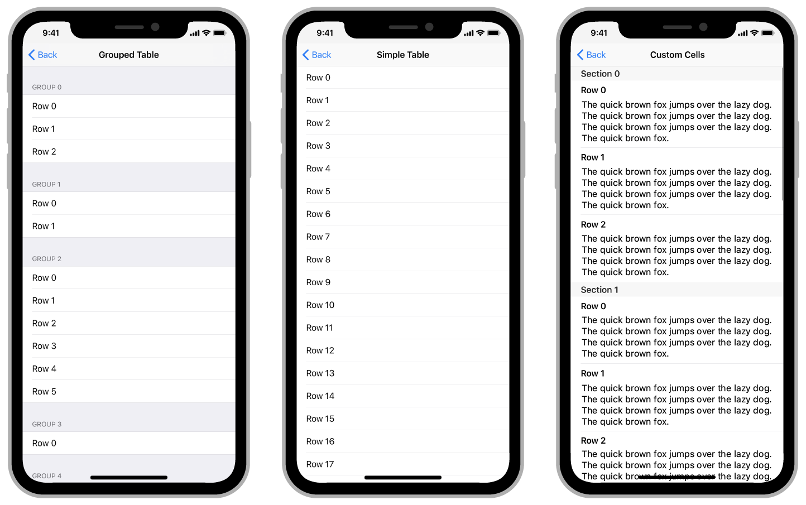

# Table Views

> 원문 출처  
> [https://developer.apple.com/documentation/uikit/views\_and\_controls/table\_views](https://developer.apple.com/documentation/uikit/views_and_controls/table_views)

## Overview

테이블 뷰는 수직으로 스크롤할 수 있는 컨텐츠를 단일 컬럼으로 보여주며 컨텐츠들은 행과 섹션으로 나누어집니다. 각 행은 앱과 관련된 정보를 표시하고 섹션은 연관된 행들을 같이 묶을 수 있게 해줍니다. 예를 들어, 연락처 앱은 사용자의 연락처에서 이름들을 표시하는데 테이블을 사용하고 있습니다.

테이블 뷰는 다음과 같은 여러 다른 객체의 조합으로 만들어집니다:

* 셀 셀은 정보의 시각적 표현을 제공합니다. UIKit에서 제공되는 기본 셀을 이용하거나 필요에 따라 커스텀 셀을 정의하여 사용할 수 있습니다.
* 테이블 뷰 컨트롤러 일반적으로 UITableViewController 객체를 사용하여 테이블 뷰를 관리합니다. 다른 뷰 컨트롤러를 사용할 수도 있지만 테이블 뷰 컨트롤러 없이는 사용할 수 없는 테이블 기능들도 있습니다.
* 데이터 소스 객체 이 객체는 UITableVuewDataSource 프로토콜을 채택하여 테이블에 데이터를 제공합니다.
* Delegate 객체 이 객체는 UITableViewDelegate 프로토콜을 채택하여 테이블 컨텐츠에 대한 사용자 상호작용을 관리합니다.

## 주제 

### Essentials

* _class_ [UITableView](uitableview.md)

  단일 열에 정렬된 행을 사용하여 데이터를 표시하는 뷰

### Data

* 데이터로 테이블 채우기 테이블 셀을 생성하고 설정하세요. 데이터 소스 객체를 사용하여 동적으로 만들거나 스토리보드에서 제공하는 정적인 셀을 사용할 수도 있습니다.
* _protocol_ UITableViewDataSource 테이블 뷰에 데이터를 관리하고 셀을 제공하기 위해 객체가 채택하는 메서드
* _protocol_ UITableViewDataSourcePrefetching 테이블 뷰의 데이터 요구 사항에 대한 사전 경고를 제공하여 장기 실행 데이터 작업을 조기에 시작할 수 있는 프로토콜입니다.
* _class_ UITableViewDiffableDataSourceReference
* _class_ UITableViewDiffableDataSource
* _class_ NSDiffableDataSourceSnapshotReference
* _class_ UILocalizedIndexedCollation 섹션 인덱스가 있는 테이블 뷰의 데이터를 구성, 정렬 및 지역화하는 객체
* _protocol_ UIDataSourceTranslating 데이터 소스 객체를 관리하는 고급 인터페이스
* _class_ UIRefreshControl 스크롤 뷰 컨텐츠를 새로고침 할 수 있는 표준 컨트롤

### 테이블 관리 

* 테이블 스크롤 영역의 높이 추정 스크롤이 컨텐츠의 크기를 정확히 반영하도록 테이블 뷰의 header, footer, row에 대한 높이 추정치를 제공하세요
* _class_ UITableViewController

  테이블 뷰 관리에 특화된 뷰 컨트롤러

* _protocol_ UITableViewDelegate 섹션 관리, 섹션 header와 footer 구성, 셀의 삭제와 재배치 및 테이블 뷰의 다른 동작을 수행하는 메서드를 제공합니다.
* _class_ UITableViewFocusUpdateContext 하나의 뷰에서 다른 뷰로 업데이트 되는 특정 포커스와 관련된 정보를 제공하는 컨텍스트 객체

### Cells, Headers, and Footers

* 테이블 셀 구성 스토리보드에서 하나 이상의 프로토타입 셀을 정의하여 테이블 행의 모양과 컨텐츠를 지정하세요
* 자체 크기 조정 테이블 뷰 셀 만들기

  동적 유형을 지원하는 테이블 뷰 셀을 작성하고 시스템 간격 제약 조건을 사용하여 텍스트 레이블 주변의 간격을 조정합니다.

* 테이블 섹션에 Header와 Footer 추가 테이블 뷰 섹션에 header와 footer 뷰를 추가하여 행 그룹을 시각적으로 다양화하세요
* _class_ [UITableViewCell](uitableviewcell.md)

  테이블 뷰 단일 행의 시각적 표현

* _class_ UITableViewHeaderFooterView

  테이블 섹션의 상단 또는 하단에 배치하여 해당 섹션에 대한 추가 정보를 표시할 수 있는 재사용 가능한 뷰입니다.

### Row Actions

* _class_ UISwipeActionsConfiguration

  테이블 행을 스와이프할 때 실행되는 action의 집합입니다.

* _class_ UIContextualAction

  사용자가 테이블 행을 스와이프할 때 표시할 action입니다.

* ~~_class_ UITableViewRowAction~~ `Deprecated`

  사용자가 테이블 행을 수평으로 스와이프할 때 표시할 action입니다.

### Selection Management

* 테이블 뷰 행 선택 관리 사용자가 테이블 뷰 셀을 누를 때를 감지하여 앱이 다음에 표시되는 작업을 수행할 수 있도록 합니다.
* 두 손가락 Pan Gesture로 여러 항목 선택 테이블 뷰와 콜렉션 뷰에서 다중 선택 제스처를 사용하여 사용자가 여러 항목을 더 빨리 선택할 수 있게 해줍니다.

### Drag and Drop

* 테이블 뷰에서 Drag and Drop 지원하기

  테이블 뷰에서 드래그 앤 드롭을 시작합니다.

* _protocol_ UITableViewDragDelegate

  테이블 뷰에서 드래그를 시작하기 위한 인터페이스

* _protocol_ UITableViewDropDelegate

  테이블 뷰에서 놓기 동작을 처리하기 위한 인터페이스

* _protocol_ UITableViewDropCoordinator

  테이블 뷰에서 커스텀 드롭 동작을 조정하기 위한 인터페이스입니다.

* _protocol_ UITableViewDropItem 테이블 뷰로 놓여지는 항목과 관련된 데이터
* _class_ UITableViewDropProposal

  테이블 뷰에서 드롭을 처리하기 위해 제안된 솔루션

### Placeholder Cells

* _protocol_ UITableViewDropPlaceholderContext

  표시할 데이터가 실제로 들어오기 전에 임시적으로 테이블 뷰에 삽입되는 객체

* _class_ UITableViewDropPlaceholder Drop preview parameter의 커스터마이징을 지원하는 Placeholder 셀
* _class_ UITableViewPlaceholder 테이블에 삽입될 자리를 가리키는 Placeholder cell에 대한 정보를 담는 객체

## 같이 보기

### 컨테이너 뷰

* Collection Views 설정 및 커스텀이 가능한 레이아웃을 사용하여 중첩된 뷰를 표시하세요.
* _class_ UIStackView 열또는 행으로 뷰 집합을 배치하기 위한 효율적인 인터페이스입니다.
* _class_ [UIScrollView](../uiscrollview.md) 포함된 뷰를 스크롤하고 확대/축소할 수 있는 뷰입니다.

