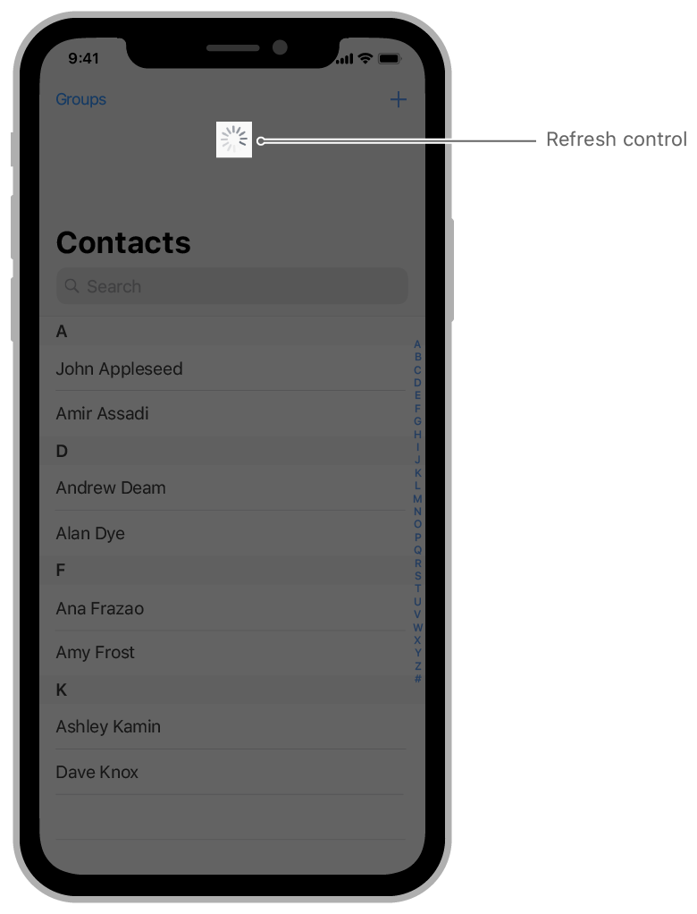

# UIRefreshControl

> 원문 출처  
> [https://developer.apple.com/documentation/uikit/uirefreshcontrol](https://developer.apple.com/documentation/uikit/uirefreshcontrol)

## Declaration



```swift
class UIRefreshControl : UIControl
```



```objectivec
@interface UIRefreshControl : UIControl
```



## Summary

> **SDKs**
>
> * iOS 6.0+
>
> **Framework**
>
> * UIKit

## 개요

UIRefreshControl 객체는 table view와 collection view를 포함한 모든 [UIScrollView](../uiscrollview.md)에 붙일 수 있는 표준 컨트롤입니다. 이 컨트롤을 스크롤 가능한 뷰에 추가하면 사용자는 표준적인 방법으로 컨텐츠를 새로고침할 수 있습니다. 사용자가 스크롤 가능한 컨텐츠 영역의 상단에서 아래로 드래그를 하면 스크롤 뷰는 Refresh control을 드러내고, progress indicator의 애니메이션을 시작하면서 앱에 노티피케이션을 보냅니다. 개발자는 이 노티피케이션을 사용하여 컨텐츠를 업데이트하고 리프레시 컨트롤을 제거할 수 있습니다.



Refresh control은 [UIControl](../../../../etc/not-found.md)의 target-action 매커니즘을 통해서 언제 컨텐츠를 업데이트 해야 할지 알려줍니다. Refresh control이 활성화가 되면 세팅된 action 메서드를 호출합니다. action 메서드를 추가할 때에는 아래 예시와 같이 [valueChanged](../../../../etc/not-found.md) 이벤트에 반응하도록 해야 합니다. action 메서드를 사용해서 컨텐츠를 업데이트하고 작업이 끝난 후에는 refresh control의 [endRefreshing\(\)](../../../../etc/not-found.md) 메서드를 호출하세요.

```swift
func configureRefreshControl () {
    //  refresh controll을 UIScrollView 객체에 추가하세요. 
    myScrollingView.refreshControl = UIRefreshControl()
    myScrollingView.refreshControl?.addTarget(self, action:
                                      #selector(handleRefreshControl),
                                      for: .valueChanged)
}

@objc func handleRefreshControl() {
   // 컨텐츠를 업데이트하세요.

   // Refresh control을 제거하세요.
   DispatchQueue.main.async {
      self.myScrollingView.refreshControl?.endRefreshing()
   }
}
```


Note

[UITableViewController](../../view-controllers/uitableviewcontroller.md)에는 테이블의 새로고침 동작을 관리하기 위한 목적으로 [refreshControl](../../../../etc/not-found.md)이 기본 프로퍼티로 포함되어 있습니다.


## 주제

### Refresh Control 초기화

* init\(\) 표준 refresh control을 초기화하고 반환합니다.

### Control 속성 접근

* var tintColor: UIColor! Refresh control의 색조
* var attributedTitle: NSAttributedString? Refresh control에 표시할 스타일 지정된 제목 텍스트

### Refresh 상태 관리

* func beginRefreshing\(\) refresh 작업이 시작됐음을 control에 알립니다.
* func endRefreshing\(\) Refresh 작업이 끝났음을 control에 알립니다.
* var isRefreshing: Bool Refresh 작업이 트리거되었고 아직 진행중임을 나타내는 Boolean 값

## 관련 문서

### 상속받은 대상

* UIControl

### 준수하는 프로토콜

* CVarArg
* Equatable
* Hashable
* UIAccessibilityIdentification
* UILargeContentViewerItem
* UIPasteConfigurationSupporting
* UIUserActivityRestoring

## 같이 보기

### Data

* Filling a Table with Data Create and configure cells for your table dynamically using a data source object, or provide them statically from your storyboard.
* _protocol_ UITableViewDataSource

  UITableViewDataSource 프로토콜은 UITableView 객체에 대한 앱 데이터 모델을 조정하는 객체에서 사용됩니다.

* _protocol_ UITableViewDataSourcePrefetching

  테이블 뷰의 데이터 요구 사항에 대한 사전 경고를 제공하여 비동기 데이터 로드 작업의 트리거를 허용하는 프로토콜입니다.

* class UITableViewDiffableDataSourceReference `Beta`
* class UITableViewDiffableDataSource `Beta`
* typealias UITableViewDiffableDataSourceReference.CellProvider Beta
* class NSDiffableDataSourceSnapshotReference `Beta`
* class UILocalizedIndexedCollation

  An object that organizes, sorts, and localizes the data for a table view that has a section index.

* protocol UIDataSourceTranslating

  An advanced interface for managing a data source object.

