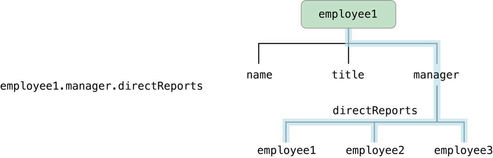

# Key-Value Observing 프로그래밍 가이드

> 원문 출처  
> [https://developer.apple.com/library/archive/documentation/Cocoa/Conceptual/KeyValueObserving/KeyValueObserving.html\#//apple\_ref/doc/uid/10000177i](https://developer.apple.com/library/archive/documentation/Cocoa/Conceptual/KeyValueObserving/KeyValueObserving.html#//apple_ref/doc/uid/10000177i)

Key-value observing은 객체가 다른 객체의 특정 속성이 변경되었을때 알림을 받을 수 있도록 해주는 메커니즘입니다.


Important

key-value observing을 이해하기 위해서는 우선 key-value coding을 이해해야 합니다.

## Key-value coding

Key-value coding은 문자열 식별자를 통하여 객체의 속성 및 관계에 간접적으로 접근하기 위한 메커니즘입니다. 이것은 몇몇 기술 및 메커니즘과 연관되어 있는데 특히 코코아 프레임워크의 Core Data, 애플리케이션 스크립팅, 바인딩 기술 및 선언된 속성의 언어 기능이 있습니다.

### 객체 프로퍼티와 KVC

Key-value coding\(이하 KVC\)의 중심은 프로퍼티 일반적인 개념입니다. 하나의 프로퍼티는 그것을 캡슐화한 객체의 상태 중 하나를 가리킵니다. 프로퍼티에는 일반적으로 두 가지 타입이 있는데 하나는 속성 \(예를 들면 name, title, subtotal, textcolor 같은 것들\)이고 다른 하나는 다른 객체와의 관계입니다. 관계는 일대일 일수도, 일대다 일수도 있습니다. 일반적으로 일대다 관계의 값 관계가 정렬된 관계인지 그렇지 않은지에 따라서 배열\(array\)이나 집합\(set\)이 됩니다.

KVC는 문자열 식별자인 key로 객체의 프로퍼티를 찾아냅니다. key는 일반적으로 객체가 정의한 접근자 메서드 또는 인스턴스 변수명으로 지정됩니다. key는 반드시 몇가지 컨벤션을 따라야 하는데, ASCII 문자열이어야 하며, 소문자로 시작하고, 공백이 있어서는 안됩니다. key path는 점으로 연결된 key들의 문자열로써 거쳐야 할 객체 프로퍼티를 순서대로 가리킵니다. 첫번째 key의 프로퍼티는 특정 객체와 관련되어 있으며 \(그림의 _employee1_에 해당\) 뒤따르는 각 key는 앞선 프로퍼티값을 기준으로 평가됩니다.

### KVC 호환 클래스 만들기

_NSKeyValueCoding_ 비공식 프로토콜은 KVC을 가능하게 합니다. NSKeyValueCoding에는 [valueForKey:](../etc/not-found.md) 와 [setValue:forKey:](../etc/not-found.md) 라는 특별히 중요한 메서드가 있는데 key가 주어지면 해당 프로퍼티값을 설정하고 불러오기 때문입니다. NSObject는 이들 메서드의 기본 구현을 제공하고 있으며 클래스가 KVC를 준수하는 경우 이 구현에 의존할 수 있습니다.

프로퍼티가 KVC를 준수하게 만드는 방법은 프로퍼티가 속성인지, 일대일 관계인지, 일대다 관계인지에 따라 다릅니다. 프로퍼티가 속성이나 일대일 관계라면 클래스 다음 우선순위에 따라 적어도 하나 이상을 구현해야 합니다. \(key는 프로퍼티 키를 의미합니다\):

1. 클래스에는 key 이름으로 된 프로퍼티가 선언되어 있어야 합니다.
2. key 이름으로 된 접근자 메서드가 구현되어 있고, 변경 가능한 프로퍼티라면 _se_tKey: 메서드도 구현합니다. \(만약 프로퍼티가 Boolean 값이라면 getter 접근자 메서드는 _is_Key 입니다\)
3. 인스턴스 변수의 형태는 _key_ 또는 _\_key_ 입니다.

일대다 관계의 프로퍼티가 KVC에 호환되게 구현하는 절차는 더욱 복잡합니다. 이 절차에 대해서 알아보려면 KVC을 명확하게 설명하는 문서를 참조하세요.


## 요약

Key-value observing은 객체가 다른 객체의 특정 속성이 변경되었을때 알림을 받을 수 있도록 해주는 메커니즘입니다. 이것은 특히 [모델과 컨트롤러단](../etc/not-found.md) 사이의 통신에서 매우 유용합니다. \(OS X에서는 [컨트롤러단](../etc/not-found.md)의 바인딩 기술이 key-value observing에 크게 의존하고 있습니다\) 컨트롤러 객체는 일반적으로 모델 객체의 프로퍼티를 관찰하고 뷰 객체는 컨트롤러를 통해서 모델 객체의 프로퍼티를 관찰합니다. 그렇지만 모델 객체도 \(종속적인 값의 변경 시기를 결정하기 위해서\) 다른 모델 객체를 관찰하거나 자기 자신까지도 관찰할 수 있습니다.

프로퍼티 관찰은 단순한 속성에서부터, 일대 일 관계나 일대 다 관계까지도 가능합니다. 일대 다 관계의 옵저버는 변경 타입과 변경과 관련된 객체에 대해서도 알 수 있습니다.

간단한 예시 그림으로 KVC이 어떻게 어플리케이션에 유용하게 동작하는지 보겠습니다. Person 객체 Account 객체와 상호작용을 가정하여 pserson이 은행의 저금하는 것을 표현할 것입니다. Person 인스턴스는 Account 인스턴스의 특정 정보\(예: 잔액, 이자율\)가 변경될 때를 알아야 할 수 있습니다.

만약 이 속성들이 Account의 공개 프로퍼티라면 Person은 주기적으로 Account를 조사하여 변경사항을 발견할수도 있겠지만, 이 방법은 매우 비효율적입니다. 더 좋은 접근법은 KVO를 사용하는 것인데, 마치 변경이 일어났을때 Person이 인터럽트를 받는것과 같이 동작합니다.

KVO를 사용하기 위해서는 우선 관찰받는 객체가 \(이 경우에는 Account\) KVO를 준수하는지를 확인해야 합니다. 일반적으로 NSObject를 상속하는 객체에서 일반적인 방법으로 생성한 프로퍼티라면 자동적으로 KVO을 준수합니다. 수동으로 호환성을 구현하는 것 또한 가능합니다. [KVO 호환성](../etc/not-found.md) 문서는 자동적인 KVO과 수동 KVO의 차이점을 서술하고 각각을 어떻게 구현하는지에 대해서 설명합니다.

다음으로, 관찰자 인스턴스 Person을 관찰되는 인스턴스 Account에 등록해야 합니다. Person은 [addObserver:forKeyPath:options:context:](../etc/not-found.md) 메세지를 Account에 보내고 관찰된 key papth마다 한번씩 자기 자신을 관찰자로 명명합니다.

Account로부터 변경 노티피케이을 받기 위해서 Person은 [observeValueForKeyPath:ofObject:change:context:](../etc/not-found.md) 메서드를 구현합니다. Account는 등록된 Key path 중 하나가 변경될 때마다 이 메세지를 Person에게 보내고 Person은 변경 노티피케이션에 따라서 적절한 조치를 취할 수 있습니다.

마지막으로 더이상 노티피케이션을 원하지 않는다면 늦어도 메모리가 해제되기 전에 Person 객체는 반드시 removeObserver:forKeyPath: 메세지를 Account에 보내서 등록을 해지해야 합니다.

[Registering for Key-Value Observing](../etc/not-found.md) 문서는 옵저버 등록, 노티피케이션 수신과 등록 해지까지 전체 라이프 사이클에 대해서 설명합니다.

KVO의 최대 장점은 프로퍼티가 변경될 때마다 알림을 보내도록 자체 스키마를 구현할 필요가 없다는 것입니다. 이것은 프레임워크 수준에서 지원하는 잘 정의된 인프라로써 아주 쉽게 사용할 수 있으며 일반적으로는 프로젝트에 코드를 추가할 필요도 없습니다.

[Registering Dependent Keys](../etc/not-found.md) 문서는 키 값과 다른 키 값간의 의존성을 명시하는 방법에 대해서 설명합니다.

[NSNotificationCenter](../etc/not-found.md)를 사용하는 노티피케이션과는 다르게 KVO에는 모든 옵저버에게 변경 노티피케이션을 제공하는 중심 객체가 없습니다. 대신에 KVO는 변경이 발생했을때 직접적으로 노티피케이션을 전달합니다. NSObject는 KVO의 기본 구현을 제공하며 이 메셔드들을 오버라이드 할 일은 아주 드뭅니다.

[Key-Value Observing Implementation Details](../etc/not-found.md) 문서는 key-value observing이 어떻게 구현되는지를 설명합니다.

